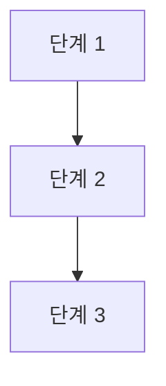

이 프로젝트에 기여해 주셔서 감사합니다! 이 문서는 새로운 학습 로드맵을 추가하거나 기존 내용을 수정할 때 지켜야 할 가이드라인을 담고 있습니다.

## 1. 파일 구조 및 명명 규칙

모든 로드맵은 주제별로 독립된 디렉토리에 관리하며, 학습 순서에 따라 번호를 부여합니다.

* **디렉토리 경로:** `🧭 Roadmap/[주제명]/`
* **파일 명명 규칙:** `[순서]-[소주제].md` (예: `00-process-thread.md`, `01-scheduling.md`)
* **언어:** 모든 문서는 한국어로 작성하는 것을 원칙으로 합니다.

---

## 2. 로드맵 작성 템플릿

새로운 로드맵 파일을 만들 때는 아래의 섹션을 반드시 포함해야 합니다.

### 2.1 상단 제목 및 개요

해당 주제를 왜 배워야 하는지, 백엔드 개발 관점에서 어떤 중요성이 있는지 간략히 서술합니다.

### 2.2 시각화 (Mermaid)

학습 흐름을 한눈에 파악할 수 있도록 `mermaid` 문법을 사용하여 순서도를 그려야 합니다.



### 2.3 🔍 상세 학습 가이드

가장 중요한 섹션입니다. 각 항목은 `###` (H3) 태그를 사용하며, 아래 내용을 포함합니다.

* **핵심 개념 설명:** 추상적인 정의보다는 동작 원리 위주로 설명.
* **Why? (핵심 질문):** 이 개념을 왜 공부해야 하는지, 실무에서 어떤 문제를 해결하는지 명시.
* **체크리스트:** 학습자가 스스로 답해볼 수 있는 포인트 제시.

---


## 3. 상세 가이드 작성 예시 (Markdown 소스)

기여자는 아래와 같은 형식으로 상세 학습 가이드를 작성해야 합니다.

```markdown
## 🔍 상세 학습 가이드

### **1. 프로세스 vs 스레드 기초**
- **개념:** 운영체제로부터 자원을 할당받는 독립된 실행 단위(프로세스)와 그 안의 실행 흐름(스레드).
- **Why?** 멀티 프로세스보다 멀티 스레드가 왜 자원 효율적인지, 동시에 발생하는 동기화 문제는 무엇인지 파악하는 것이 목표입니다.

### **2. 메모리 구조 (Memory Layout)**
- **내용:** Code, Data, Heap, Stack 구획의 역할 공부.
- **핵심:** 특히 **Stack은 스레드마다 독립적**이고, **Heap은 공유**한다는 사실이 백엔드 코드(공유 변수 문제)에 어떤 영향을 주는지 파악해야 합니다.

### **3. 컨텍스트 스위칭 (Context Switching)**
- **내용:** CPU가 실행 프로세스를 교체할 때 PCB(Process Control Block)에 상태를 저장하고 복원하는 과정.
- **Why?** 컨텍스트 스위칭 오버헤드가 발생할 때 시스템 성능이 왜 떨어지는지 기술적으로 이해합니다.

### **4. 동기화 (Synchronization)**
- **중요성:** 여러 스레드가 동시에 데이터를 수정할 때 발생하는 **Race Condition** 방지.
- **연결:** 뮤텍스(Mutex), 세마포어(Semaphore)의 차이를 이해하고, 사용하는 언어(Java, Go 등)의 Lock 라이브러리와 연결하여 학습합니다.

### **5. 교착상태 (Deadlock)**
- **개념:** 자원을 점유한 프로세스들이 서로의 자원을 무한정 기다리는 상태.
- **필수:** 데드락의 4가지 발생 조건(상호 배제, 점유 대기, 비선점, 환형 대기)과 이를 해결하는 전략을 학습합니다.

```

---

## 4. 기여 프로세스 (Issue & Pull Request)

프로젝트에 새로운 내용을 추가하거나 수정할 때는 main 브랜치에 직접 커밋하지 마십시오.

1. 이슈(Issue) 생성: 작업할 내용에 대해 먼저 이슈를 생성하고 의견을 나눕니다
2. 브랜치(Branch) 생성: 아래 규칙에 따라 로컬 브랜치를 생성합니다.
    - 브랜치 이름 규칙: [기여자이름]/roadmap (예: duskafka/roadmap)
3. 작업 및 푸시: 생성한 브랜치에서 작업을 완료한 후 원격 저장소에 푸시합니다.
4. PR(Pull Request) 생성: 작업 결과물을 main 브랜치로 합쳐달라는 PR을 보냅니다. 리뷰 후 승인이 완료되면 main에 반영됩니다.
