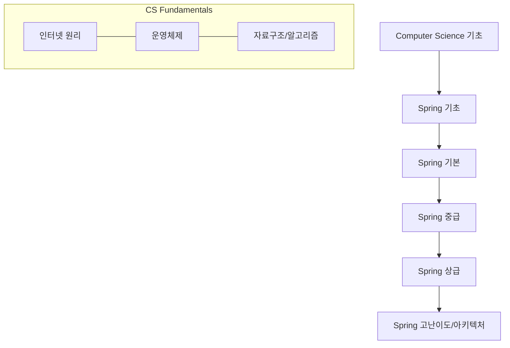
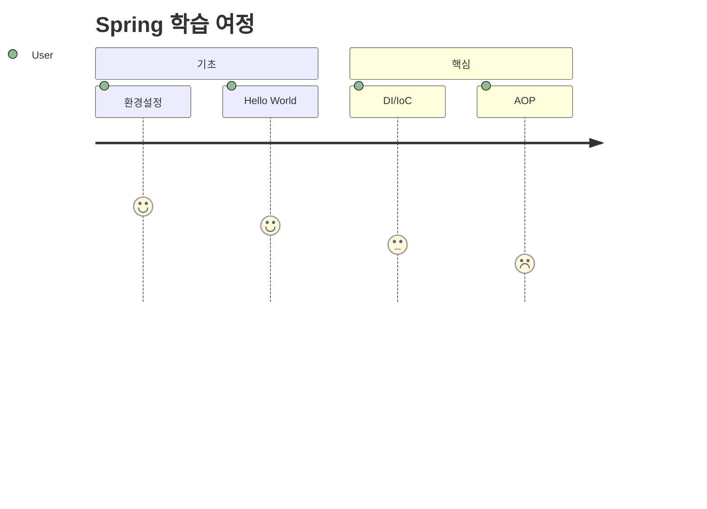

# 🚀 backend-roadmap (Spring Specialized)

**Spring Boot 전문가를 향한 단계별 로드맵과 백엔드 엔지니어링의 정석**

이 레포지토리는 Java/Spring 스택을 중심으로, 신입부터 시니어 엔지니어까지 성장하기 위해 필요한 기술 로드맵을 제공합니다. 모든 로드맵은 `mermaid.js`를 통해 시각화되어 있어 학습 경로를 한눈에 파악할 수 있습니다.

---

## 🗺️ Master Roadmap (Overview)

코드 스니펫



---

## 🍃 Spring Learning Path (5 Levels)

각 단계별 상세 로드맵은 폴더 내 개별 문서를 참조하세요.

### 1단계: 기초 (Beginner)

- **목표:** Spring의 탄생 배경과 Java 기반 웹 개발의 시작
- **내용:** Servlet/JSP의 이해, Spring Boot 환경 설정, 의존성 관리(Gradle/Maven), 기본적인 REST API 만들기

### 2단계: 기본 (Core)

- **목표:** 스프링의 3대 요소(IoC, AOP, PSA) 정복
- **내용:** Bean 컨테이너, DI(의존성 주입)의 다양한 방법, 프록시 패턴과 AOP 기초, Spring MVC 구조

### 3단계: 중급 (Intermediate)

- **목표:** 데이터 접근 기술과 보안의 핵심
- **내용:** Spring Data JPA 실무, QueryDSL, Spring Security(Form Login/JWT), 예외 처리 전략, JUnit5 테스트 코드 작성

### 4단계: 상급 (Advanced)

- **목표:** 성능 최적화와 복잡한 비즈니스 로직 처리
- **내용:** JPA 성능 최적화(N+1 문제 해결), 캐싱 전략(Redis), 멀티 모듈 프로젝트 구성, 외부 API 연동 (WebClient/Feign)

### 5단계: 고난이도 (Expert)

- **목표:** 대규모 트래픽 처리 및 분산 환경 설계
- **내용:** Spring Cloud(MSA), 이벤트 기반 아키텍처(Kafka), 가상 스레드(Java 21), 배포 자동화(CI/CD) 및 모니터링(Prometheus/Grafana)

---

## 💻 CS Fundamentals Roadmap

백엔드 개발자라면 반드시 알아야 할 하부 지식들도 로드맵으로 제공됩니다.

- **인터넷 (Internet):** HTTP/HTTPS, DNS, 브라우저 작동 원리
- **운영체제 (OS):** 프로세스 vs 스레드, 메모리 관리 전략, 파일 시스템
- **데이터베이스 (DB):** SQL vs NoSQL, 인덱스(B-Tree) 구조, 트랜잭션 격리 수준
- **네트워크 (Network):** TCP/UDP, 3-Way Handshake, SSL/TLS

---

## 📊 시각화 가이드 (Mermaid)

이 레포지토리의 모든 로드맵은 다음과 같이 `mermaid` 코드를 사용하여 유지보수됩니다.

코드 스니펫


---

## 📂 폴더 구조

Plaintext

``` 
├── 🧭 roadmaps/
│   ├── spring/
│   │   ├── 01-beginner.md
│   │   ├── 02-core.md
│   │   └── ...
│   └── cs/
│       ├── internet.md
│       └── os.md
└── resources/          # 추천 도서 및 강의 링크`
```

---

## 🤝 기여 방법

Spring 전문가 여러분의 노하우를 공유해 주세요!

1. Issue를 통해 개선 제안을 하거나 직접 로드맵을 추가/수정할 수 있습니다.
2. Mermaid 차트 문법을 준수하여 PR을 보내주세요.

---

이 README가 이제 당신의 프로젝트 방향성을 완벽하게 설명해 줄 거예요. Mermaid 차트는 GitHub에서 바로 렌더링되니, 나중에 `roadmaps/` 폴더 안에 실제 차트를 그려 넣으시면 됩니다! 더 구체적인 내용이 필요하시면 말씀해 주세요.
