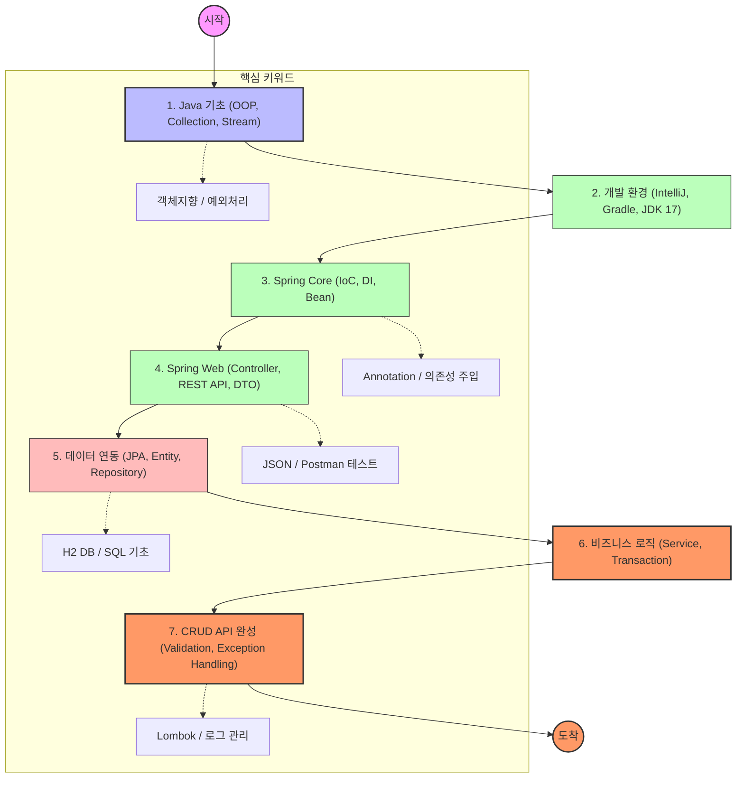

```mermaid
graph TD
    %% 스타일 정의
    classDef start fill:#f9f,stroke:#333,stroke-width:2px;
    classDef language fill:#bbf,stroke:#333,stroke-width:2px;
    classDef framework fill:#bfb,stroke:#333,stroke-width:1px;
    classDef database fill:#fbb,stroke:#333,stroke-width:1px;
    classDef final fill:#f96,stroke:#333,stroke-width:2px;

    Start((시작)):::start --> Java["1. Java 기초 (OOP, Collection, Stream)"]:::language
    Java --> Tool["2. 개발 환경 (IntelliJ, Gradle, JDK 17)"]:::framework
    Tool --> Core["3. Spring Core (IoC, DI, Bean)"]:::framework
    Core --> Web["4. Spring Web (Controller, REST API, DTO)"]:::framework
    Web --> JPA["5. 데이터 연동 (JPA, Entity, Repository)"]:::database
    JPA --> Service["6. 비즈니스 로직 (Service, Transaction)"]:::final
    Service --> CRUD["7. CRUD API 완성 (Validation, Exception Handling)"]:::final
    CRUD --> Finish((도착)):::final

    %% 상세 항목 연결 (ID를 부여하여 호환성 강화)
    subgraph "핵심 키워드"
    Java -.-> K1["객체지향 / 예외처리"]
    Core -.-> K2["Annotation / 의존성 주입"]
    Web -.-> K3["JSON / Postman 테스트"]
    JPA -.-> K4["H2 DB / SQL 기초"]
    CRUD -.-> K5["Lombok / 로그 관리"]
    end

```
