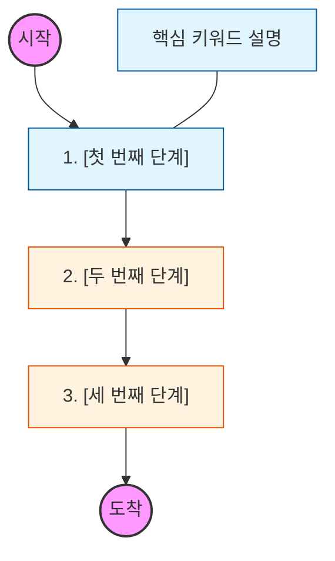

# 📑 TEMPLATE.md

이 파일은 새로운 학습 로드맵 문서를 작성할 때 사용하는 공식 양식입니다. 아래 내용을 전체 복사하여 `🧭 Roadmap/[주제명]/[번호]-[소주제].md` 파일을 생성해 주세요.

---

# 🧭 [소주제 제목을 입력하세요]

> **해당 학습의 목표:** [이 학습을 통해 어떤 역량을 얻게 되는지 한 문장으로 요약하세요.]

---

## 🛣️ Learning Roadmap

[이 단계에서 학습할 핵심 키워드들을 Mermaid 차트로 시각화하세요.]

---

## 🔍 상세 학습 가이드

### **1. [첫 번째 학습 항목]**

* **개념:** [학습 내용에 대한 핵심 정의를 적어주세요.]
* **Why?** [백엔드 개발자에게 이 개념이 왜 중요한지, 실무에서 어떤 문제를 해결하는지 작성하세요.]

### **2. [두 번째 학습 항목]**

* **개념:** [학습 내용에 대한 핵심 정의를 적어주세요.]
* **Why?** [이 지식이 실제 시스템 아키텍처나 코드 레벨에서 어떻게 동작하는지 설명하세요.]

### **3. [핵심 심화 항목]**

* **핵심 원리:** [단순 정의를 넘어 내부 동작 원리(Internal)를 파고드세요.]
* **체크리스트:** [학습자가 스스로 답할 수 있는 질문을 하나 던져주세요. (예: ~의 차이점은 무엇인가?)]

### **4. [실무 및 장애 대응]**

* **상황:** [해당 개념과 관련된 흔한 장애 상황이나 최적화 포인트를 적어주세요.]
* **대응:** [어떻게 해결하거나 설계해야 하는지 가이드를 제시하세요.]

---

## 🔗 관련 참고 자료 (Optional)

* [링크 제목](https://www.google.com/search?q=URL) - 어떤 부분에 도움이 되는 자료인지 짧은 설명
