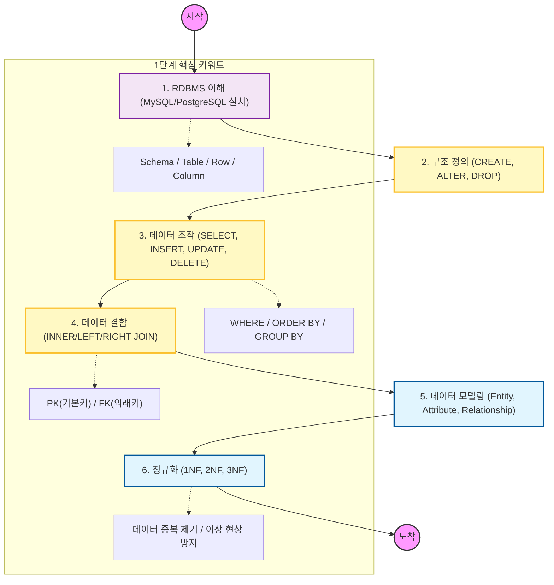

1단계의 목표는 **데이터를 안전하게 저장하고, 원하는 데이터를 정확하게 뽑아오는 것**. 복잡한 튜닝보다는 관계형 데이터베이스(RDBMS)의 표준 문법과 설계의 기초를 다지는 데 집중

```mermaid
graph TD
    %% 스타일 정의
    classDef point fill:#f9f,stroke:#333,stroke-width:2px;
    classDef sql fill:#fff9c4,stroke:#fbc02d,stroke-width:2px;
    classDef design fill:#e1f5fe,stroke:#01579b,stroke-width:2px;
    classDef concept fill:#f3e5f5,stroke:#7b1fa2,stroke-width:2px;

    Start((시작)):::point --> RDBMS["1. RDBMS 이해 (MySQL/PostgreSQL 설치)"]:::concept
    RDBMS --> DDL["2. 구조 정의 (CREATE, ALTER, DROP)"]:::sql
    DDL --> DML["3. 데이터 조작 (SELECT, INSERT, UPDATE, DELETE)"]:::sql
    DML --> Join["4. 데이터 결합 (INNER/LEFT/RIGHT JOIN)"]:::sql
    Join --> Design["5. 데이터 모델링 (Entity, Attribute, Relationship)"]:::design
    Design --> Normalization["6. 정규화 (1NF, 2NF, 3NF)"]:::design
    Normalization --> Finish((도착)):::point

    %% 상세 키워드 연결
    subgraph "1단계 핵심 키워드"
    RDBMS -.-> K1["Schema / Table / Row / Column"]
    DML -.-> K2["WHERE / ORDER BY / GROUP BY"]
    Join -.-> K3["PK(기본키) / FK(외래키)"]
    Normalization -.-> K4["데이터 중복 제거 / 이상 현상 방지"]
    end
```
