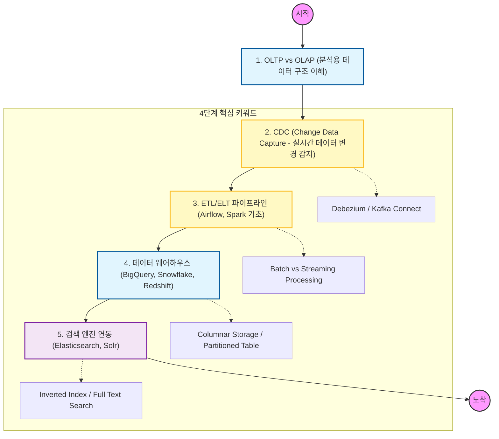

4단계의 핵심 키워드는 **파이프라인**과 **분석**. 서비스 DB(OLTP)의 부하를 줄이면서 대량의 데이터를 분석용 저장소(OLAP)로 안전하게 옮기는 기술을 학습해야 함.

```mermaid
graph TD
    %% 스타일 정의
    classDef point fill:#f9f,stroke:#333,stroke-width:2px;
    classDef etl fill:#fff9c4,stroke:#fbc02d,stroke-width:2px;
    classDef dw fill:#e1f5fe,stroke:#01579b,stroke-width:2px;
    classDef search fill:#f3e5f5,stroke:#7b1fa2,stroke-width:2px;
    classDef final fill:#f96,stroke:#333,stroke-width:2px;

    Start((시작)):::point --> OLAP["1. OLTP vs OLAP (분석용 데이터 구조 이해)"]:::dw
    OLAP --> CDC["2. CDC (Change Data Capture - 실시간 데이터 변경 감지)"]:::etl
    CDC --> ETL["3. ETL/ELT 파이프라인 (Airflow, Spark 기초)"]:::etl
    ETL --> DW["4. 데이터 웨어하우스 (BigQuery, Snowflake, Redshift)"]:::dw
    DW --> SearchEngine["5. 검색 엔진 연동 (Elasticsearch, Solr)"]:::search
    SearchEngine --> Finish((도착)):::point

    %% 상세 키워드 연결
    subgraph "4단계 핵심 키워드"
    CDC -.-> K1["Debezium / Kafka Connect"]
    ETL -.-> K2["Batch vs Streaming Processing"]
    SearchEngine -.-> K3["Inverted Index / Full Text Search"]
    DW -.-> K4["Columnar Storage / Partitioned Table"]
    end
```
