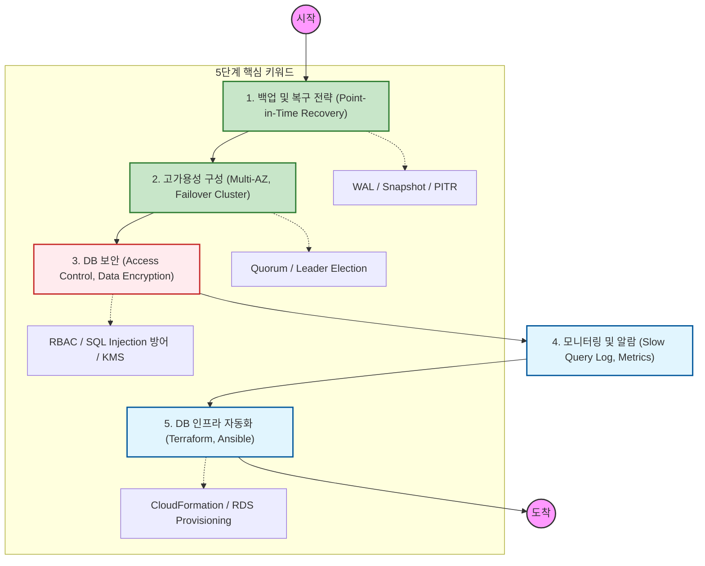

5단계의 핵심은 **안정성**과 **운영 자동화**. 어떤 재난 상황에서도 데이터를 복구할 수 있고, 인프라를 코드로 관리하여 실수를 줄이는 것이 목표

```mermaid
graph TD
    %% 스타일 정의
    classDef point fill:#f9f,stroke:#333,stroke-width:2px;
    classDef security fill:#ffebee,stroke:#c62828,stroke-width:2px;
    classDef reliability fill:#c8e6c9,stroke:#2e7d32,stroke-width:2px;
    classDef automation fill:#e1f5fe,stroke:#01579b,stroke-width:2px;
    classDef final fill:#f96,stroke:#333,stroke-width:2px;

    Start((시작)):::point --> Backup["1. 백업 및 복구 전략 (Point-in-Time Recovery)"]:::reliability
    Backup --> HighAvailability["2. 고가용성 구성 (Multi-AZ, Failover Cluster)"]:::reliability
    HighAvailability --> Security["3. DB 보안 (Access Control, Data Encryption)"]:::security
    Security --> Monitoring["4. 모니터링 및 알람 (Slow Query Log, Metrics)"]:::automation
    Monitoring --> IaC["5. DB 인프라 자동화 (Terraform, Ansible)"]:::automation
    IaC --> Finish((도착)):::point

    %% 상세 키워드 연결
    subgraph "5단계 핵심 키워드"
    Backup -.-> K1["WAL / Snapshot / PITR"]
    Security -.-> K2["RBAC / SQL Injection 방어 / KMS"]
    HighAvailability -.-> K3["Quorum / Leader Election"]
    IaC -.-> K4["CloudFormation / RDS Provisioning"]
    end
```
