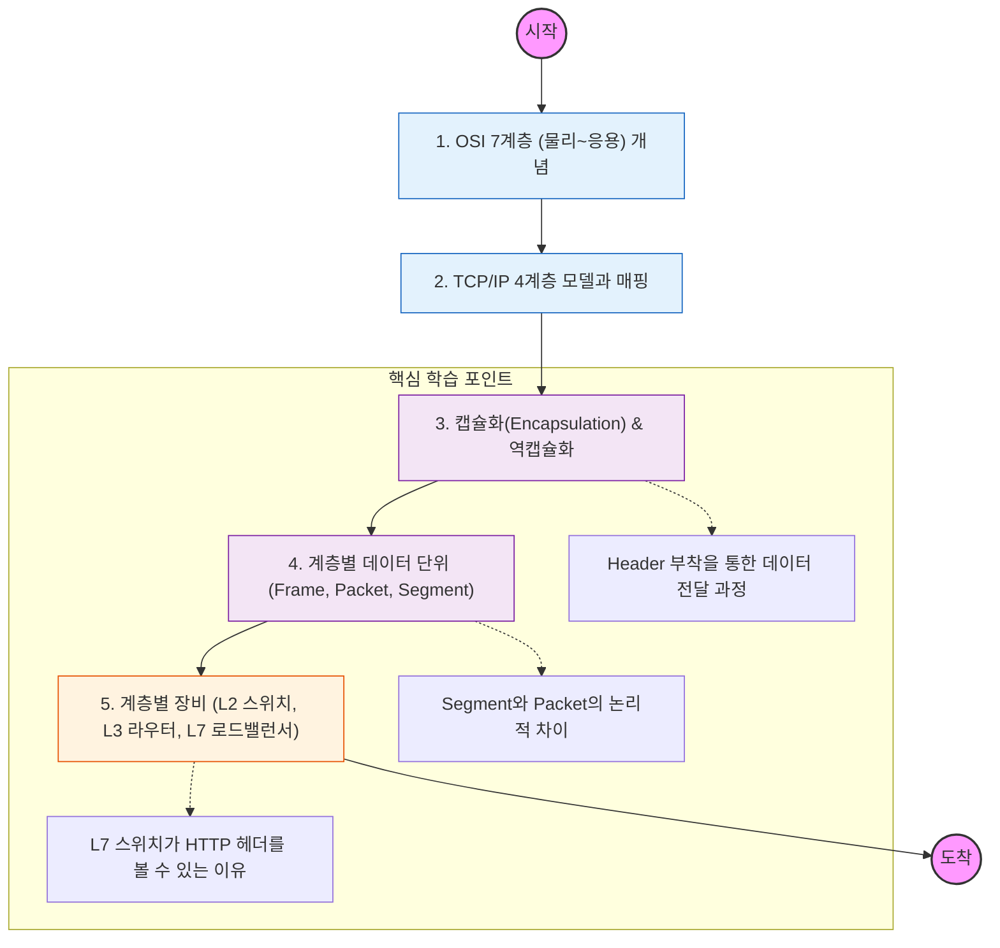

네트워크 모델은 복잡한 통신 과정을 역할별로 나눈 표준임. 각 계층이 어떤 데이터를 다루고 어떤 역할을 하는지 파악하는 것이 중요함.

---

## 🔍 단계별 필수 수행 지침

### **1. OSI 7계층의 각 역할을 정의할 것**

- 물리(1)부터 응용(7)까지 각 계층이 왜 존재하는지 한 문장으로 설명할 수 있어야 함.
- 특히 4계층(전송)과 3계층(네트워크)의 책임 분계(프로세스 간 전달 vs 호스트 간 전달)를 명확히 구분해야 함.

### **2. 캡슐화(Encapsulation) 과정을 도식화할 것**

- 상위 계층의 데이터가 하위 계층으로 내려가면서 헤더(Header)가 붙는 과정을 이해해야 함.
- 반대로 수신 측에서 헤더를 하나씩 떼어내며 상위 계층으로 올리는 **역캡슐화** 과정도 숙지할 것.

### **3. 계층별 데이터 단위(PDU)를 암기할 것**

- *Segment(4계층), Packet(3계층), Frame(2계층)**이라는 용어를 혼용하지 말고 정확히 사용할 것.
- 어느 계층에서 에러 체크가 일어나는지, 어느 계층에서 주소(IP, MAC)가 붙는지 파악할 것.

### **4. 네트워크 장비의 계층적 이해를 가질 것**

- **L2 스위치:** MAC 주소를 보고 전달함.
- **L3 라우터:** IP 주소를 보고 경로를 찾음.
- **L7 로드밸런서:** HTTP URL이나 쿠키 정보를 보고 서버를 배분함.
- "왜 L3 장비는 L4 헤더를 볼 수 없는가?"에 대한 답을 계층 구조 관점에서 찾아낼 것.
