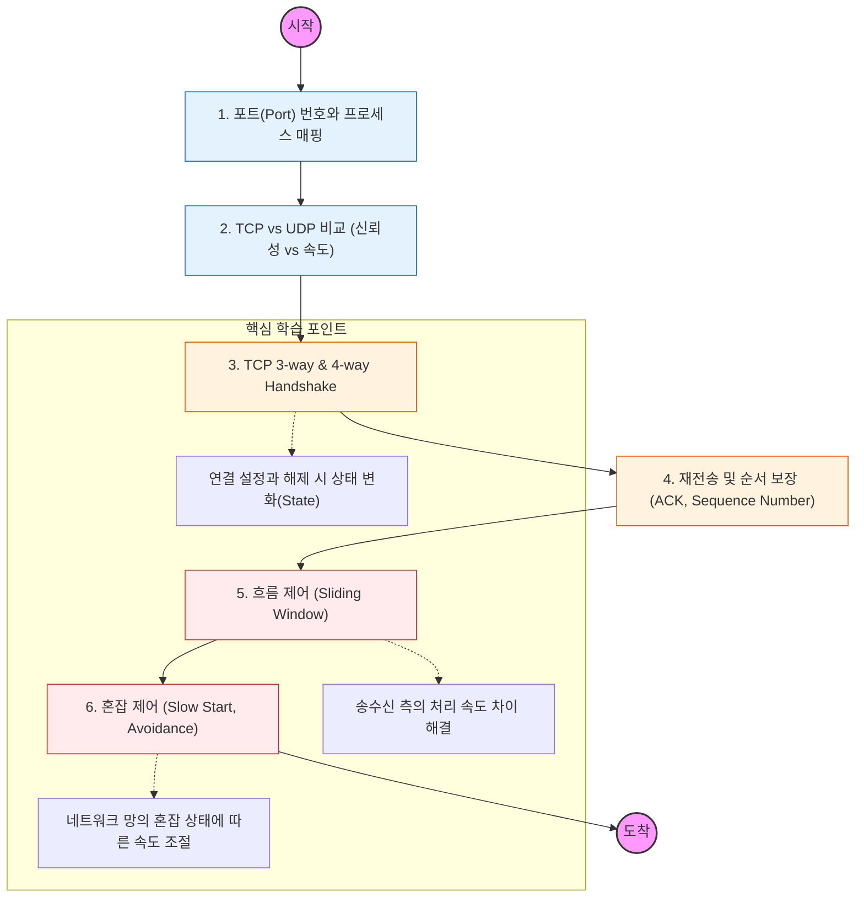

전송 계층은 "양 끝단의 프로세스 간(End-to-End) 신뢰성 있는 데이터 전송"을 책임짐. 포트(Port) 번호를 통해 어떤 어플리케이션으로 데이터를 보낼지 결정함.

---

## 🔍 단계별 필수 수행 지침

### **1. TCP와 UDP의 특징을 대조하여 암기할 것**

- **TCP:** 연결 지향, 신뢰성 보장, 흐름/혼잡 제어 있음 (웹, 파일 전송).
- **UDP:** 비연결 지향, 신뢰성 없음, 속도 빠름 (스트리밍, DNS, 게임).
- 왜 HTTP/3는 UDP 기반의 QUIC 프로토콜을 사용하는지 그 이유를 반드시 조사할 것.

### **2. TCP 연결 및 해제 과정을 도식화할 것 (매우 중요)**

- **3-way Handshake:** `SYN` -> `SYN+ACK` -> `ACK` 과정을 통해 논리적 연결을 맺는 법을 익힐 것.
- **4-way Handshake:** `FIN` -> `ACK` -> `FIN` -> `ACK` 과정을 통해 안전하게 연결을 끊는 법을 익힐 것.
- **TIME_WAIT** 상태가 왜 필요한지, 서버 성능에 어떤 영향을 주는지 공부해야 함.

### **3. 데이터 신뢰성 보장 메커니즘을 파악할 것**

- **Sequence Number**와 **Acknowledgment Number(ACK)**를 통해 패킷의 순서를 맞추고 유실 시 재전송하는 과정을 이해해야 함.

### **4. 흐름 제어(Flow Control)의 슬라이딩 윈도우를 이해할 것**

- 수신 측의 버퍼가 넘치지 않게 송신 측의 데이터 양을 조절하는 **Sliding Window** 기법을 공부해야 함.
- 윈도우 크기(Window Size)가 성능에 미치는 영향을 파악할 것.

### **5. 혼잡 제어(Congestion Control) 알고리즘을 분석할 것**

- 네트워크 전체가 막히지 않도록 데이터 전송 속도를 제어하는 **Slow Start**, **Congestion Avoidance** 등의 단계를 학습해야 함.
- 패킷 유실 발생 시 전송량을 급격히 줄이는 이유를 이해할 것.
