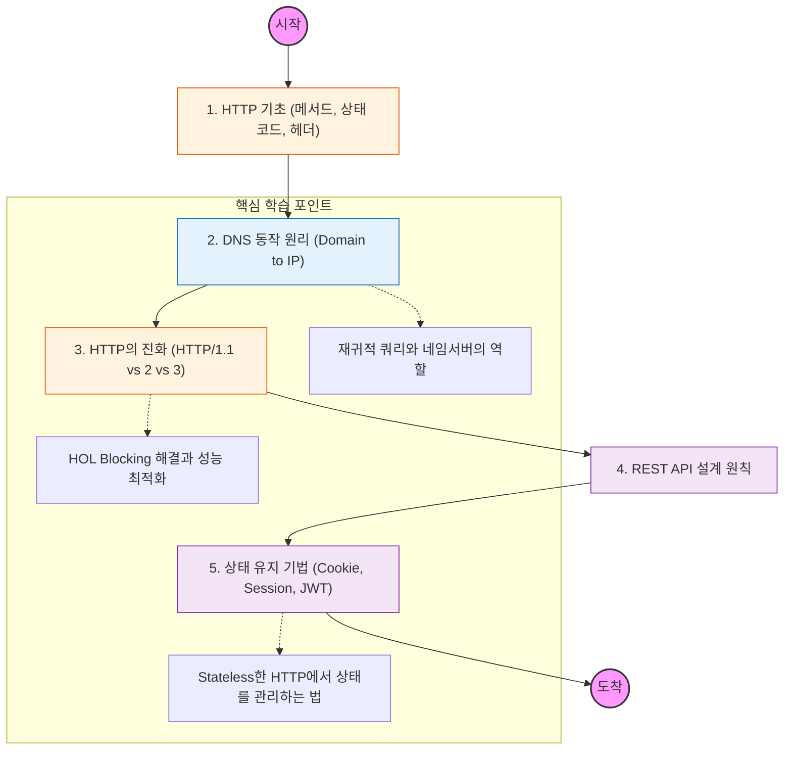

응용 계층은 "사용자와 소프트웨어가 네트워크 서비스와 직접 상호작용하는 계층"임. 데이터의 의미를 해석하고 특정 서비스(웹, 메일, 파일 전송 등)를 제공하는 역할을 함.

---

## 🔍 단계별 필수 수행 지침

### **1. HTTP 프로토콜의 무상태성(Stateless)을 이해할 것**

- HTTP는 기본적으로 이전 요청을 기억하지 않음. 이 특징이 서버 확장성(Scalability)에 어떤 도움을 주는지 파악해야 함.
- **HTTP 메서드**의 의미와 **멱등성(Idempotency)** 개념을 반드시 정리할 것.

### **2. DNS(Domain Name System)의 탐색 과정을 추적할 것**

- 브라우저에 URL을 쳤을 때, 어떻게 전 세계 네임서버를 거쳐 IP를 가져오는지 그 흐름을 공부해야 함.
- **Root -> TLD -> Authoritative 네임서버** 순으로 이어지는 재귀적 조리(Recursive Query) 과정을 도식화할 것.

### **3. HTTP 버전별 성능 차이를 분석할 것 (핵심)**

- **HTTP/1.1:** Keep-Alive와 HOL(Head-of-Line) Blocking 문제.
- **HTTP/2:** 멀티플렉싱(Multiplexing)을 통한 속도 개선.
- **HTTP/3:** UDP(QUIC) 기반으로 지연 시간을 극한으로 줄인 원리.
    
    [Image comparison of HTTP/1.1 vs HTTP/2 multiplexing vs HTTP/3 QUIC]
    

### **4. API 설계 및 상태 관리 전략을 세울 것**

- 자원을 명사로 표현하는 **REST API**의 설계 철학을 학습해야 함.
- 인증과 인가를 위해 사용하는 **Cookie, Session**의 차이점과, 분산 환경에서 왜 JWT(JSON Web Token)가 선호되는지 그 이유를 기술적으로 설명할 수 있어야 함.

### **5. L7 로드밸런싱의 원리를 파악할 것**

- 단순히 IP/Port만 보는 L4와 달리, L7 로드밸런서가 어떻게 **URL 경로, 쿠키, 헤더**를 보고 트래픽을 분산(Application Delivery)하는지 공부할 것.
