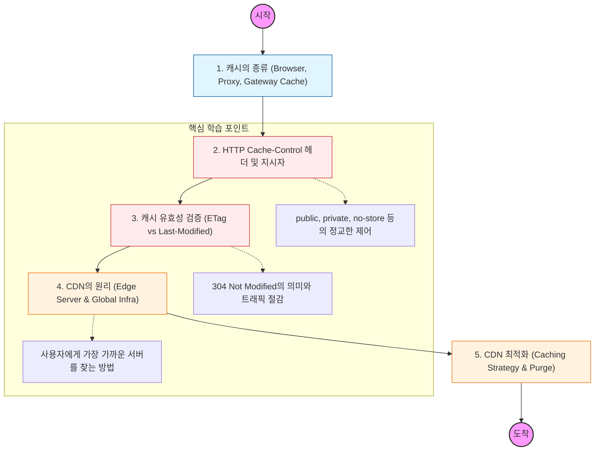

캐싱은 "이미 계산되거나 전송된 데이터를 재사용하는 것"이고, CDN은 "그 데이터를 전송하는 물리적 거리를 단축하는 것"임.

---

## 🔍 단계별 필수 수행 지침

### 1. HTTP 캐시 제어 헤더를 마스터할 것

- **Cache-Control** 헤더의 다양한 지시자(`max-age`, `public`, `private`, `no-cache`, `no-store`)의 차이점을 명확히 구분해야 함.
- `no-cache`가 "캐시를 하지 말라"는 뜻이 아니라 "사용하기 전에 서버에 물어보라"는 뜻임을 정확히 파악할 것.

### 2. 캐시 유효성 검증(Validation) 메커니즘을 이해할 것

- 캐시가 만료되었을 때 데이터가 실제로 변했는지 확인하는 ETag(Hash)와 **Last-Modified**의 동작 원리를 공부해야 함.
- 서버가 **304 Not Modified** 응답을 보낼 때 바디 데이터가 전송되지 않아 발생하는 성능 이득을 체감할 것.

### 3. CDN(Content Delivery Network)의 지리적 이점을 파악할 것

- 전 세계에 분산된 **Edge Server**가 사용자 요청을 대신 처리하여 Latency(지연 시간)를 줄이는 원리를 학습해야 함.
- 물리적 거리가 네트워크 속도에 미치는 영향과, PoP(Point of Presence)의 개념을 이해할 것.

### 4. CDN의 캐싱 전략을 설계할 것

- **Static Content**와 **Dynamic Content**를 CDN에서 어떻게 다르게 처리할지 전략을 세워야 함.
- 원본 서버(Origin)의 부하를 줄이기 위한 캐시 적중률(Hit Ratio) 최적화 방법을 공부할 것.

### 5. 캐시 무효화(Purge) 및 버전 관리 전략을 세울 것

- 데이터가 업데이트되었을 때 CDN이나 브라우저에 남아있는 잘못된 캐시를 강제로 제거하는 **Purge/Invalidation** 기법을 익힐 것.
- 파일명 뒤에 해시값을 붙이는 **Fingerprinting** 기법이 왜 강력한 캐싱 전략인지 분석할 것.
