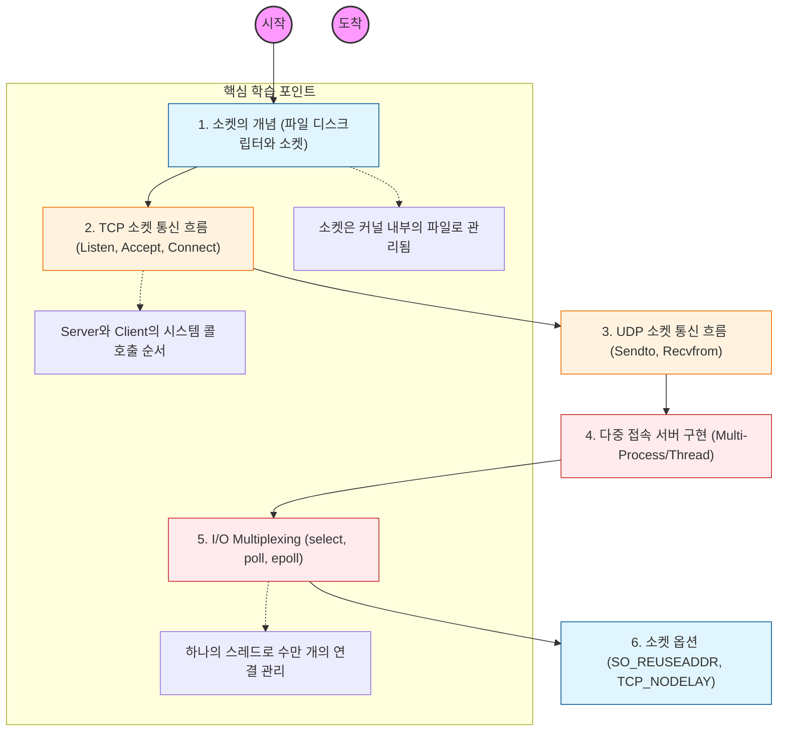

소켓은 "네트워크상에서 통신하기 위한 양 끝점(Endpoint)"이며, IP 주소와 포트 번호의 결합으로 식별됨.

---

## 🔍 단계별 필수 수행 지침

### 1. 소켓과 파일 디스크립터의 관계를 파악할 것

- 유닉스 계열 OS에서 소켓은 하나의 파일로 취급됨을 인지해야 함.
- 소켓 생성 시 반환되는 정수형 값(**File Descriptor**)이 커널 내부의 소켓 구조체를 가리키는 원리를 학습할 것.

### 2. TCP 소켓의 연결 수립 과정을 코드로 시뮬레이션할 것

- 서버 측: `socket()` -> `bind()` -> `listen()` -> `accept()`
- 클라이언트 측: `socket()` -> `connect()`
- 각 시스템 콜이 호출될 때 L4 계층의 **3-way Handshake**가 어느 시점에서 발생하는지 정확히 매핑할 것.

### 3. UDP 소켓의 비연결성 전송을 실습할 것

- `listen()`과 `accept()` 과정 없이 `sendto()`와 `recvfrom()`만으로 데이터를 주고받는 구조를 파악할 것.
- 신뢰성이 없는 UDP 소켓에서 어플리케이션이 직접 무결성을 보장해야 하는 상황을 이해할 것.

### 4. 고성능 I/O 모델인 epoll(Linux)을 정복해야 함

- 수만 명의 동시 접속자를 처리하기 위해 CPU가 대기하지 않고 이벤트가 발생한 소켓만 찾아내는 **I/O Multiplexing** 원리를 공부할 것.
- `select`의 선형 탐색 한계를 `epoll`이 어떻게 상수 시간 수준으로 해결했는지 분석할 것.

### 5. 실무에 필요한 소켓 옵션을 조사할 것

- **SO_REUSEADDR:** 서버 재시작 시 `TIME_WAIT` 상태의 포트를 즉시 재사용하는 법.
- **TCP_NODELAY (Nagle 알고리즘):** 작은 패킷을 모으지 않고 즉시 전송하여 지연 시간을 줄이는 법.
- 백엔드 설정 파일(Nginx, Tomcat 등)의 소켓 관련 옵션들이 이 지식에서 기인함을 인지할 것.
