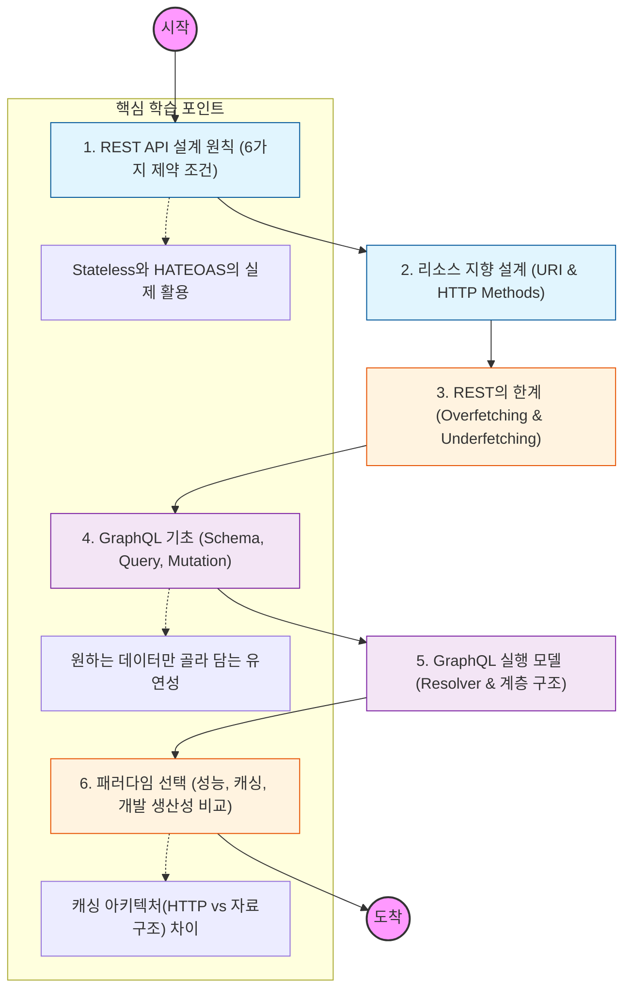

API는 단순히 데이터를 전달하는 통로를 넘어, 서비스의 확장성과 유연성을 결정짓는 인터페이스 설계의 핵심임.

---

## 🔍 단계별 필수 수행 지침

### 1. REST의 6가지 제약 조건을 명확히 파악할 것

- **Client-Server, Stateless, Cacheable, Layered System, Code-on-Demand, Uniform Interface**를 학습해야 함.
- 특히 **Uniform Interface**를 만족하기 위한 리소스 식별과 메시지를 통한 자기계약성(Self-descriptive)의 의미를 이해할 것.

### 2. 리소스 중심의 URI 설계 능력을 갖출 것

- 동사(`.../getUser`)가 아닌 명사(`.../users`)를 사용하고, 행위는 HTTP Method로 표현하는 규칙을 익힐 것.
- 계층 관계를 표현하는 경로 설계와 버전 관리(Versioning) 전략을 공부할 것.

### 3. REST의 고질적인 데이터 전송 문제를 분석할 것

- **Overfetching:** 필요 없는 데이터까지 다 받는 문제.
- **Underfetching:** 필요한 데이터를 얻기 위해 여러 번 요청해야 하는 문제(N+1 요청 문제).
- 이 문제들이 모바일 환경이나 복잡한 객체 그래프 구조에서 어떤 성능 저하를 일으키는지 파악할 것.

### 4. GraphQL의 스키마와 쿼리 언어를 정복할 것

- **Schema First** 개발 방식의 장점을 이해하고, 강력한 타입 시스템을 학습할 것.
- 클라이언트가 요청하는 모양 그대로 응답이 오는 쿼리(Query)와 데이터 변경을 위한 뮤테이션(Mutation)의 구조를 익힐 것.

### 5. 리졸버(Resolver)의 동작 원리를 이해할 것

- 특정 필드에 대한 데이터를 가져오는 로직인 리졸버가 어떻게 계층적으로 실행되는지 파악할 것.
- GraphQL에서 발생할 수 있는 **N+1 쿼리 문제**와 이를 해결하기 위한 **DataLoader(배칭/캐싱)** 기법을 반드시 학습할 것.

### 6. 프로젝트 성격에 따른 패러다임 선택 기준을 세울 것

- **REST:** HTTP 캐싱 인프라 활용이 중요하고, 인터페이스가 정형화된 경우 유리함.
- **GraphQL:** 다양한 클라이언트 요구사항이 있고, 화면마다 필요한 데이터 조각이 빈번하게 변하는 경우 유리함.
- 두 기술은 배타적인 것이 아니라, 하나의 서비스에서도 용도에 따라 혼용될 수 있음을 인지할 것.
