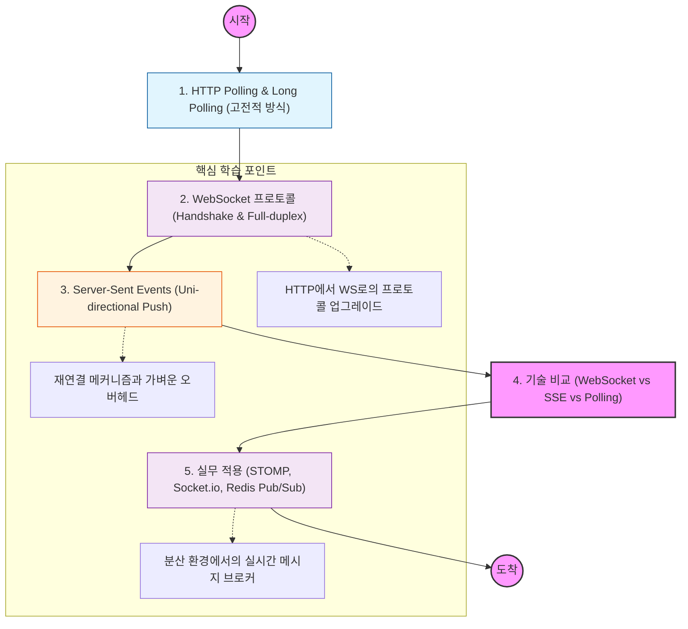

전통적인 HTTP는 요청이 있어야 응답이 오는 구조이지만, 실시간 통신은 연결을 유지하며 필요한 순간에 데이터를 즉시 주고받는 것이 핵심임.

---

## 🔍 단계별 필수 수행 지침

### 1. 실시간 통신의 발전 과정을 추적할 것

- **Polling:** 주기적으로 묻는 방식 (자원 낭비).
- **Long Polling:** 데이터가 생길 때까지 연결을 열어두는 방식 (서버 부하).
- 이들의 한계가 무엇인지, 왜 새로운 프로토콜이 필요했는지 그 배경을 이해할 것.

### 2. WebSocket의 핸드쉐이크(Handshake) 원리를 파악할 것

- 웹소켓이 처음에는 HTTP로 시작하여 `Upgrade` 헤더를 통해 전이중(Full-duplex) 통신으로 전환되는 과정을 학습해야 함.
- 한 번 연결되면 HTTP 헤더 없이 가벼운 프레임 단위로 데이터를 주고받는 메커니즘을 이해할 것.

### 3. SSE(Server-Sent Events)의 특수성을 이해할 것

- 서버에서 클라이언트로만 흐르는 **단방향(Uni-directional)** 스트림임을 명심할 것.
- 표준 HTTP 프로토콜을 사용하므로 방화벽 통과가 쉽고, 자동으로 재연결을 시도하는 특징을 공부할 것.
- `text/event-stream` 미디어 타입의 구조를 파악할 것.

### 4. WebSocket과 SSE의 선택 기준을 정립할 것

- **WebSocket:** 채팅, 멀티플레이어 게임, 주식 트레이딩 (양방향, 잦은 상호작용).
- **SSE:** 알림 서비스, 실시간 뉴스 피드, 주가 지수 모니터링 (서버에서 일방적인 업데이트).
- 데이터의 방향성과 오버헤드 관점에서 어떤 기술이 유리한지 비교할 것.
    
    [Image comparison table between WebSockets and Server-Sent Events]
    

### 5. 분산 환경에서의 실시간 메시징 이슈를 분석할 것

- 서버가 여러 대일 때(L4/L7 로드밸런싱 환경), 특정 서버에 연결된 클라이언트에게 어떻게 메시지를 전달할지 고민할 것.
- **Redis Pub/Sub**이나 **Kafka**와 같은 메시지 브로커를 소켓 서버와 결합하여 사용하는 아키텍처를 학습할 것.
