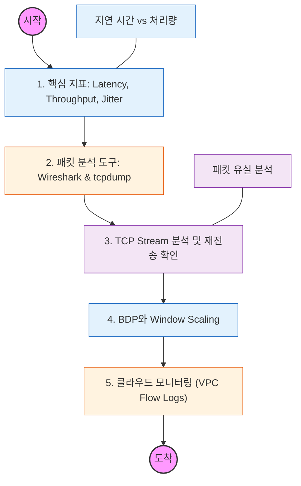

네트워크가 "느리다"는 모호한 문제를 수치로 진단하고, 패킷 레벨에서 병목 지점을 찾아내는 능력을 기르는 과정입니다.

---

## 🔍 단계별 필수 수행 지침

### 1. 네트워크 성능의 3대 지표를 정의할 것

- **Latency (지연 시간):** 데이터가 한 지점에서 다른 지점으로 이동하는 데 걸리는 시간(RTT).
- **Throughput (처리량):** 단위 시간당 성공적으로 전송된 데이터의 양.
- **Jitter (지터):** 지연 시간의 변동폭. 실시간 서비스(VoIP, 스트리밍)에서 왜 중요한지 파악할 것.

### 2. 패킷 캡처 도구(Wireshark, tcpdump) 사용법을 익힐 것

- 실제 서비스 중인 서버에서 패킷을 캡처하고, 특정 프로토콜(HTTP, TCP)이나 특정 IP로 필터링하는 법을 학습할 것.
- **TCP 3-way Handshake**가 실제로 어떻게 일어나는지 패킷 단위로 확인해 볼 것.

### 3. 지연(Latency)의 원인을 분석할 것

- **Propagation Delay:** 물리적 거리로 인한 지연.
- **Transmission Delay:** 링크의 대역폭 한계로 인한 지연.
- **Queuing Delay:** 장비(라우터 등)의 버퍼에서 대기하는 시간. 어떤 상황에서 각 지연이 지배적인지 구분할 것.

### 4. 대역폭 지연 곱(BDP)과 성능 최적화를 이해할 것

- **BDP (Bandwidth Delay Product):** 파이프라인에 가득 채울 수 있는 데이터의 양.
- 고속 네트워크에서 **TCP Window Scaling** 옵션이 성능에 미치는 영향을 파악할 것.

### 5. 클라우드 환경의 모니터링 기법을 학습할 것

- AWS VPC Flow Logs와 같은 도구를 통해 인프라 수준에서 어떤 트래픽이 오가는지, 어디서 패킷이 거절(Reject)되는지 분석하는 법을 익힐 것.
