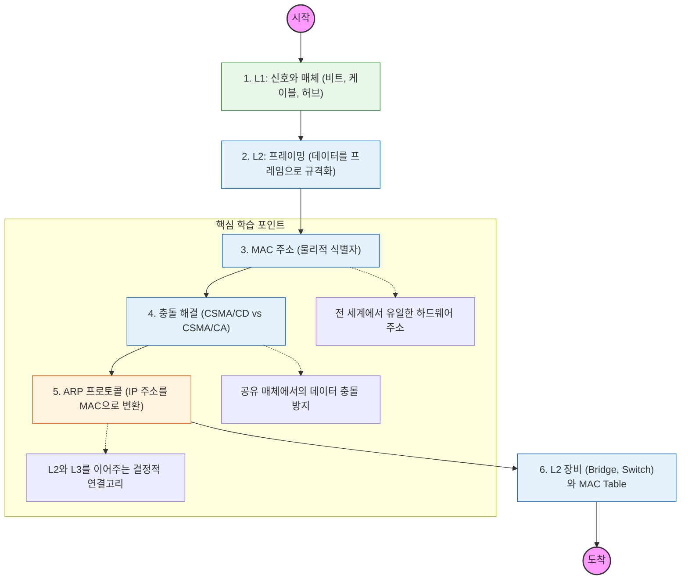

물리 계층은 비트(Bit) 전달에 집중하고, 데이터 링크 계층은 프레임(Frame) 단위로 인접 노드 간의 신뢰성 있는 전송을 책임짐.

---

## 🔍 단계별 필수 수행 지침

### **1. 물리 계층(L1)의 한계를 인식할 것**

- 데이터의 의미는 신경 쓰지 않고, 0과 1을 전기 신호나 광신호로 바꾸는 역할임.
- 허브(Hub)가 왜 모든 포트에 데이터를 뿌리는지(Flooding), 왜 충돌에 취약한지 파악해야 함.

### **2. MAC 주소의 구조를 파악할 것**

- 48비트로 구성된 하드웨어 고유 번호임을 이해할 것.
- IP 주소는 바뀔 수 있지만, MAC 주소는 기기 고유의 식별자라는 차이점을 명확히 할 것.

### **3. 이더넷(Ethernet)과 CSMA/CD를 학습할 것**

- 유선 네트워크에서 데이터를 보내기 전 회선이 사용 중인지 확인하고, 충돌 발생 시 처리하는 메커니즘을 공부해야 함.
- 현대의 전이중(Full-duplex) 스위치 환경에서는 왜 충돌이 거의 없는지도 이해할 것.

### **4. ARP(Address Resolution Protocol)를 정복해야 함 (중요)**

- 상대방의 IP 주소는 알지만 MAC 주소를 모를 때 사용하는 프로토콜임.
- **ARP Reply(유니캐스트)** 와 **ARP Request(브로드캐스트)** 과정을 머릿속으로 그릴 수 있어야 함.
- `arp -a` 명령어로 자신의 PC에 저장된 ARP 캐시 테이블을 직접 확인할 것.

### **5. L2 스위치의 동작 원리를 이해할 것**

- 스위치가 어떻게 목적지 MAC 주소를 학습하여 **MAC 주소 테이블**을 만드는지 파악할 것.
- 허브와 달리 필요한 포트로만 데이터를 보내는 **Filtering/Forwarding** 기능을 숙지해야 함.
