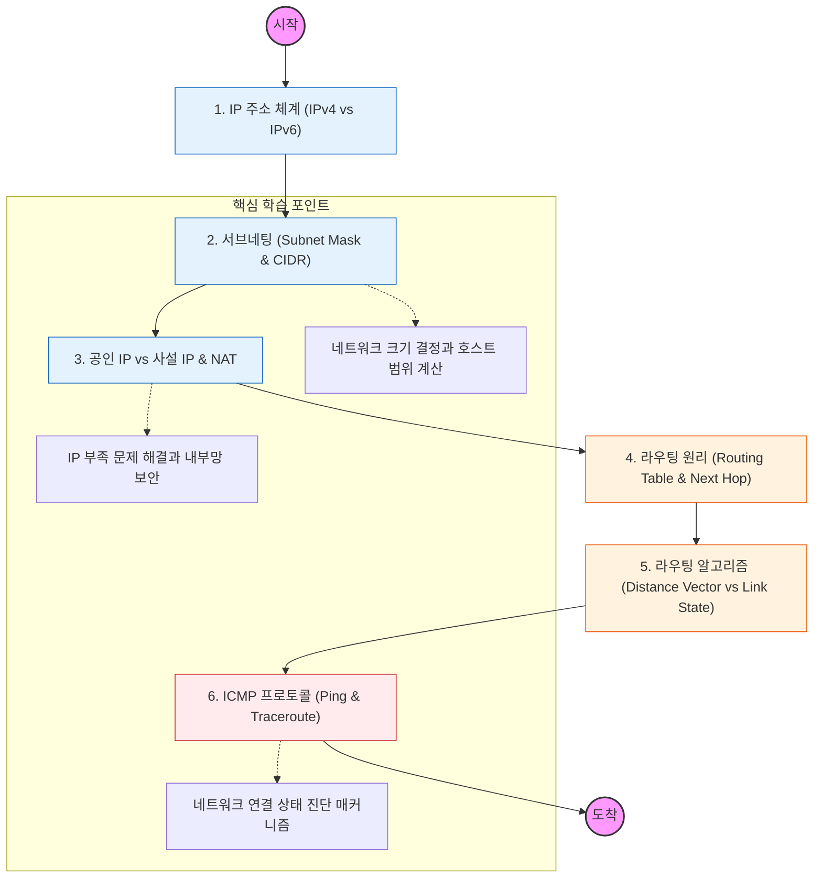

네트워크 계층은 "데이터 패킷을 목적지까지 가장 안전하고 빠르게 전달(Routing)"하는 책임을 가짐. 논리적인 주소 체계인 IP를 이해하는 것이 최우선임.

---

## 🔍 단계별 필수 수행 지침

### **1. IP 주소의 구조와 서브네팅을 마스터할 것**

- 32비트 IPv4 주소가 네트워크 주소와 호스트 주소로 어떻게 나뉘는지 파악해야 함.
- **서브넷 마스크**를 이용해 네트워크를 쪼개는 이유(브로드캐스트 도메인 분리)를 이해할 것.
- 최근 실무 표준인 **CIDR(Classless Inter-Domain Routing)** 표기법에 익숙해져야 함.

### **2. NAT(Network Address Translation)의 동작 원리를 이해할 것**

- 사설 IP를 사용하는 내부망 컴퓨터들이 어떻게 하나의 공인 IP로 외부 인터넷과 통신하는지 학습해야 함.
- 공유기가 어떻게 포트 번호를 매핑하여 응답을 돌려주는지(PAT) 과정을 공부할 것.

### **3. 라우팅 테이블(Routing Table)을 해석할 수 있어야 함**

- 데이터 패킷이 들어왔을 때 어디로 보낼지 결정하는 이정표인 라우팅 테이블의 구조를 파악할 것.
- 가장 구체적인 경로를 우선시하는 **Longest Prefix Match** 원칙을 반드시 학습해야 함.

### **4. 주요 라우팅 알고리즘을 비교 분석할 것**

- **RIP(Distance Vector):** 거리(Hop count) 기반의 단순한 방식.
- **OSPF(Link State):** 전체 지도(Topology)를 그려 최단 경로를 찾는 방식.
- 전 세계 인터넷 경로를 결정하는 **BGP**의 개념까지 가볍게 훑어볼 것.

### **5. ICMP를 활용한 진단 도구를 실습할 것**

- **Ping:** 상대방 호스트가 살아있는지 확인하는 원리.
- **Traceroute:** 목적지까지 가는 경로상의 라우터들을 하나씩 확인하는 법(TTL 값 활용).
- 네트워크 장애 발생 시 L3 수준에서 어디가 끊겼는지 찾아내는 능력을 기를 것.
