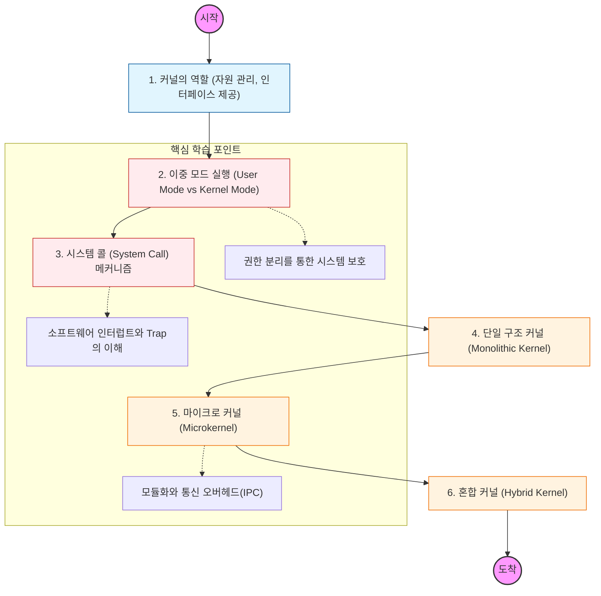

커널은 운영체제의 핵심부로, 메모리에 항상 상주하며 하드웨어 자원을 관리하고 프로세스에게 제어권을 배분하는 역할을 수행함.

---

## 🔍 단계별 필수 수행 지침

### **1. 이중 모드(Dual-mode) 운영의 이유를 파악할 것**

- 사용자가 직접 하드웨어를 건드리지 못하게 차단하는 사용자 모드(User Mode)와 모든 권한을 가진 커널 모드(Kernel Mode)의 차이를 공부해야 함.
- 모드 비트(Mode Bit)가 어떻게 바뀌는지 하드웨어적 관점에서 이해할 것.

### **2. 시스템 콜(System Call) 인터페이스를 정복해야 함**

- 어플리케이션이 파일 쓰기, 네트워크 통신 등을 위해 커널에 서비스를 요청하는 통로임.
- API(표준 라이브러리) 호출이 어떻게 시스템 콜로 이어지고, 인터럽트(Trap)가 발생하는지 그 흐름을 추적할 것.

### **3. 단일 구조 커널(Monolithic Kernel)의 장단점을 분석할 것**

- 모든 커널 서비스(파일 시스템, 네트워크, 스케줄링 등)가 하나의 거대한 주소 공간에 있는 구조임.
- 리눅스(Linux)가 왜 이 방식을 사용하는지, 성능상의 이점과 관리상의 위험을 비교할 것.

### **4. 마이크로 커널(Microkernel)의 철학을 이해할 것**

- 커널에는 최소한의 기능(IPC, 메모리 관리 등)만 남기고 나머지는 사용자 영역으로 올린 구조임.
- 서버 안정성과 확장성이 높지만, **프로세스 간 통신(IPC)** 오버헤드가 발생하는 이유를 학습해야 함.

### **5. 하이브리드 커널(Hybrid Kernel)의 실례를 찾아볼 것**

- 성능을 위해 단일 구조를 취하면서도 마이크로 커널의 구조적 이점을 결합한 형태임.
- 우리가 사용하는 Windows(NT 커널)나 macOS(XNU 커널)가 어떤 방식을 취하고 있는지 조사할 것.
