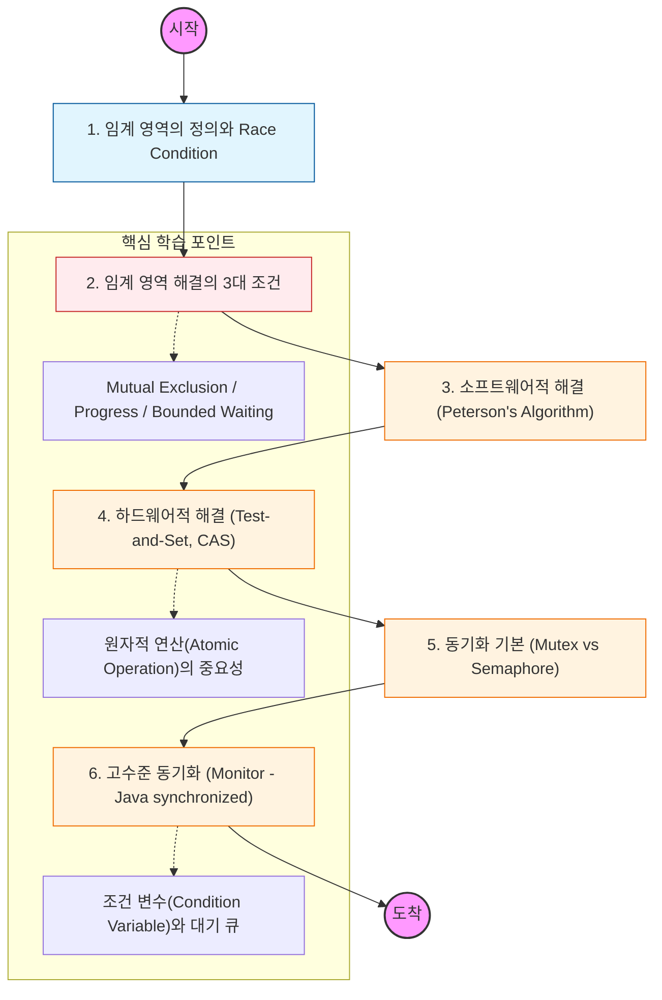

임계 영역은 "공유 자원에 접근하는 프로그램 코드의 일부"를 의미함. 이 영역은 반드시 한 번에 하나의 프로세스만 실행되어야 함을 명심할 것.

---

## 🔍 단계별 필수 수행 지침

### **1. 임계 영역 해결을 위한 3대 조건을 암기할 것**

- **상호 배제(Mutual Exclusion):** 이미 한 프로세스가 있으면 다른 놈은 못 들어옴.
- **진행(Progress):** 임계 영역에 아무도 없으면 들어갈 놈을 바로 결정해야 함.
- **한정 대기(Bounded Waiting):** 무한정 기다리는 놈이 없도록 대기 시간에 제한이 있어야 함.

### **2. 경쟁 상태(Race Condition)의 위험성을 코드로 확인해야 함**

- 두 개의 스레드가 하나의 변수를 10,000번씩 더했을 때, 결과가 20,000이 나오지 않는 이유를 **CPU 명령어(Read-Modify-Write)** 관점에서 분석할 것.

### **3. 하드웨어적 지원(Atomic Instructions)을 공부할 것**

- 소프트웨어적인 해결책은 복잡하고 오버헤드가 큼.
- CPU가 제공하는 `Test-and-Set`이나 `Compare-and-Swap(CAS)` 같은 원자적 명령어가 어떻게 동기화의 기초가 되는지 파악할 것. 자바의 `AtomicInteger`가 이 원리를 사용함을 인지할 것.

### **4. 뮤텍스(Mutex)와 세마포어(Semaphore)를 비교 분석할 것**

- **뮤텍스:** 화장실 열쇠가 하나뿐인 상황 (소유권 존재).
- **세마포어:** 신호등 혹은 화장실 칸이 여러 개인 상황 (카운팅 가능).
- 바이너리 세마포어와 뮤텍스의 미묘한 차이(Priority Inheritance 등)를 찾아볼 것.

### **5. 모니터(Monitor) 구조를 정복해야 함**

- 매번 Lock을 걸고 푸는 복잡함을 해결하기 위해 등장한 고수준 추상화 도구임.
- 자바의 `synchronized` 키워드와 `Wait/Notify` 메커니즘이 모니터 이론을 바탕으로 설계되었음을 반드시 이해해야 함.
