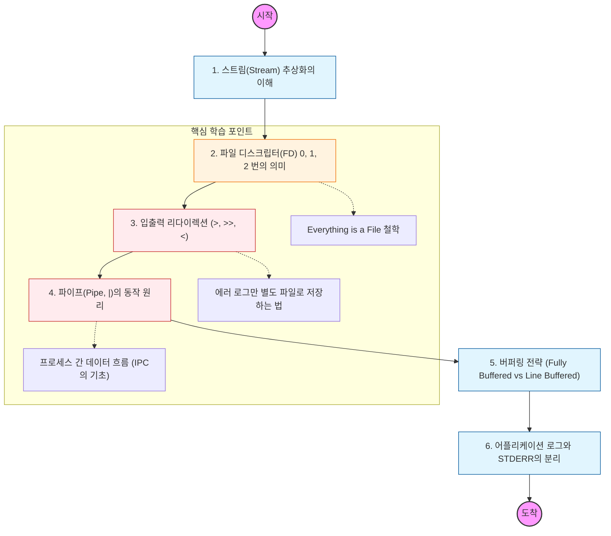

모든 프로세스는 실행될 때 기본적으로 3개의 데이터 통로를 할당받음. 이를 **파일 디스크립터(File Descriptor)** 관점에서 이해하는 것이 핵심임.

---

## 🔍 단계별 필수 수행 지침

### **1. 파일 디스크립터(FD) 번호를 암기할 것**

- **0번: STDIN** (표준 입력 - 보통 키보드)
- **1번: STDOUT** (표준 출력 - 보통 터미널 화면)
- **2번: STDERR** (표준 에러 - 보통 터미널 화면)
- 리눅스에서 "모든 것은 파일이다"라는 철학 아래, 이 스트림들도 결국 숫자로 관리되는 파일임을 명심할 것.

### **2. 리다이렉션(Redirection) 문법을 완벽히 숙지할 것**

- `>` : 기존 내용을 덮어쓰고 출력 저장.
- `>>` : 기존 내용 뒤에 추가(Append).
- `2>` : 표준 에러만 따로 저장. (예: `find / -name "*.txt" 2> error.log`)
- `2>&1` : 에러를 표준 출력으로 합쳐서 내보내는 고급 문법을 반드시 이해할 것.

### **3. 파이프(Pipe, `|`)의 데이터 흐름을 추적할 것**

- 앞 프로세스의 **STDOUT**을 뒤 프로세스의 **STDIN**으로 연결하는 원리를 공부해야 함.
- `ps -ef | grep java` 같은 명령어가 내부적으로 두 프로세스를 어떻게 연결하는지 학습할 것.

### **4. 버퍼링(Buffering)의 차이를 인지할 것**

- 터미널 출력(Line Buffered)과 파일 저장(Fully Buffered) 시 데이터가 써지는 시점이 다를 수 있음을 공부해야 함.
- 로그가 실시간으로 보이지 않을 때 왜 버퍼를 비워야(Flush) 하는지 그 이유를 파악할 것.

### **5. 클라우드/컨테이너 환경의 로그 처리를 분석할 것**

- Docker나 Kubernetes 환경에서 왜 어플리케이션 로그를 파일이 아닌 **STDOUT/STDERR**로 내보내야 하는지 그 설계 철학을 이해할 것. (로그 수집기가 이 스트림을 가로채서 수집하기 때문임.)
