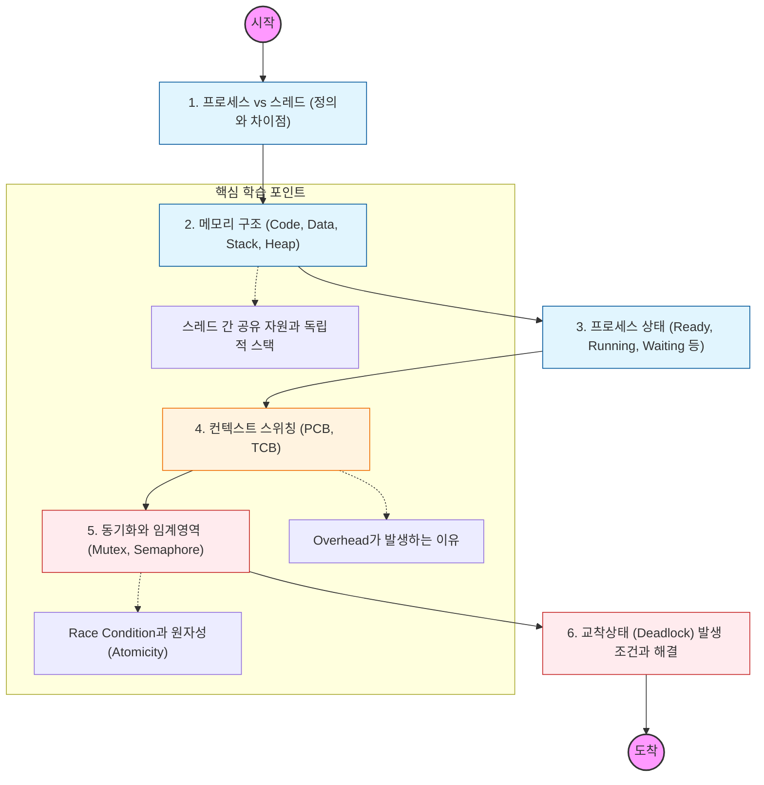

프로세스와 스레드는 운영체제의 가장 기본이자, 백엔드 서버의 동시성(Concurrency)을 이해하는 핵심

---

## 🔍 상세 학습 가이드

### **1. 프로세스 vs 스레드 기초**

- **프로세스:** 운영체제로부터 자원을 할당받는 작업의 단위.
- **스레드:** 프로세스 내에서 실행되는 흐름의 단위.
- **Why?** 왜 멀티 프로세스보다 멀티 스레드가 자원 효율적인지, 하지만 왜 동기화 문제가 발생하는지 이해하는 게 목표

### **2. 메모리 구조 (Memory Layout)**

- 프로세스가 메모리에 올라올 때 구획이 어떻게 나뉘는지 공부
- 특히 **Stack은 스레드마다 독립적**이고, **Heap은 공유**한다는 사실이 백엔드 코드(공유 변수 문제)에 어떤 영향을 주는지 파악할 것

### **3. 컨텍스트 스위칭 (Context Switching)**

- CPU가 실행하는 프로세스를 바꿀 때 일어나는 일
- PCB(Process Control Block)에 무엇이 저장되는지, 왜 컨텍스트 스위칭이 빈번하면 시스템 성능이 떨어지는지 공부

### **4. 동기화 (Synchronization)**

- 백엔드 개발자에게 가장 중요한 구간이야! 여러 스레드가 동시에 같은 데이터를 수정할 때 발생하는 **Race Condition**을 막는 법을 학습할 것.
- 뮤텍스(Mutex), 세마포어(Semaphore)의 차이와 자바의 `synchronized`, `Lock` 등이 내부적으로 어떻게 이 개념을 쓰는지 연결해볼 것

### **5. 교착상태 (Deadlock)**

- 두 개 이상의 프로세스가 서로의 자원을 무한정 기다리는 상태
- 데드락의 4가지 발생 조건(상호 배제, 점유 대기, 비선점, 환형 대기)과 이를 피하는 전략을 학습
