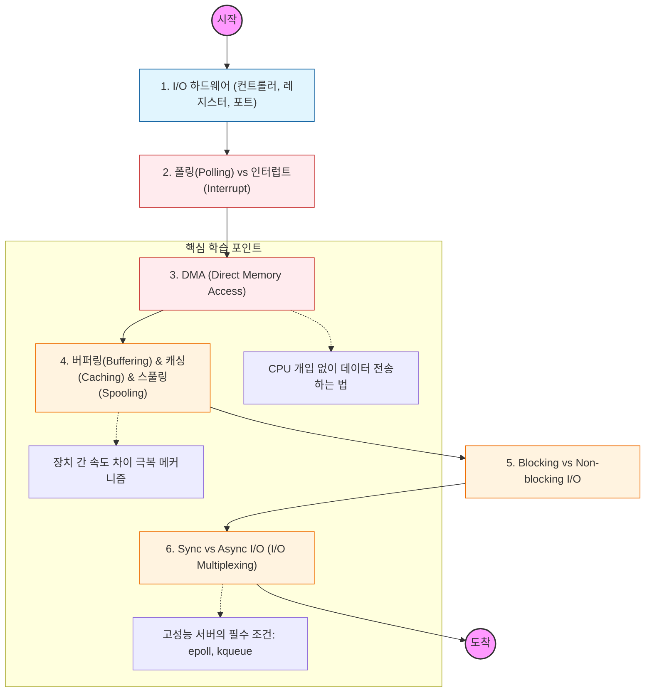

I/O 시스템의 핵심은 "CPU가 I/O 작업이 완료될 때까지 놀지 않게 만드는 것"임. 이를 위한 다양한 하드웨어적, 소프트웨어적 기법을 정복해야 함

---

## 🔍 단계별 필수 수행 지침

### **1. 인터럽트(Interrupt) 기반 I/O를 완벽히 이해할 것**

- CPU가 I/O가 끝날 때까지 무한 대기하는 **폴링**의 비효율성을 파악해야 함.
- I/O 장치가 작업을 끝내고 CPU에 신호를 보내는 **인터럽트**의 동작 원리와 ISR(Interrupt Service Routine)의 실행 과정을 학습해야 함.

### **2. DMA(Direct Memory Access)의 필요성을 증명할 것**

- 대량의 데이터를 옮길 때마다 CPU가 개입하면 성능이 심각하게 저하됨.
- CPU의 도움 없이 I/O 장치와 메모리가 직접 데이터를 주고받는 **DMA 컨트롤러**의 역할을 공부해야 함.

### **3. 버퍼링(Buffering)과 캐싱(Caching)을 구분할 것**

- **버퍼링:** 장치 간 데이터 전송 속도 차이를 완충하기 위해 임시 저장함.
- **캐싱:** 자주 쓰이는 데이터를 미리 복사해 두어 성능을 향상함.
- **스풀링:** 프린터처럼 공유 장치에 데이터를 순차적으로 보내기 위해 큐를 사용하는 기법임을 명시할 것.

### **4. Blocking vs Non-blocking의 차이를 도식화할 것**

- **Blocking:** I/O 작업이 끝날 때까지 제어권을 넘기지 않고 대기함.
- **Non-blocking:** I/O 작업 요청 즉시 제어권을 반환받아 다른 일을 수행함.
- 백엔드 프레임워크(WebFlux 등)가 왜 Non-blocking을 지향하는지 그 이유를 이 단계에서 찾아낼 것.

### **5. I/O 다중화(Multiplexing)를 정복해야 함**

- 하나의 스레드가 수천 개의 소켓 I/O를 감시할 수 있게 해주는 `select`, `poll`, 특히 리눅스의 `epoll` 원리를 학습해야 함.
- 이것이 현대적인 고성능 서버(Nginx, Redis, Netty)의 근간임을 명심할 것.
