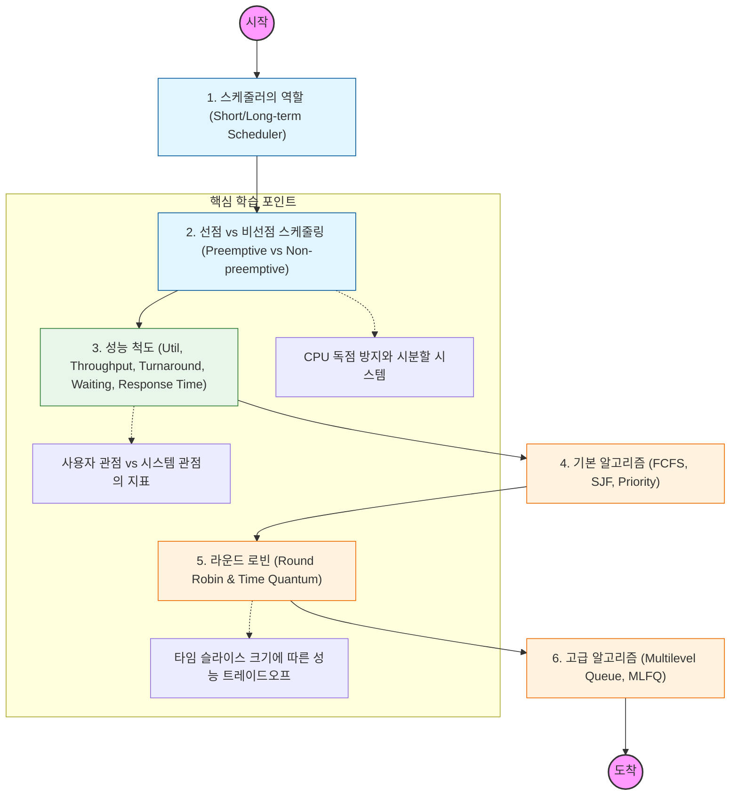

CPU 스케줄러가 어떤 기준으로 프로세스를 선택하고, 어떤 알고리즘들이 있는지 단계별로 학습.

---

## 🔍 상세 학습 가이드

### **1. 선점(Preemptive) vs 비선점(Non-preemptive)**

- **비선점:** 프로세스가 스스로 CPU를 반납할 때까지 기다리는 방식 (예: FCFS).
- **선점:** OS가 강제로 CPU를 뺏어 다른 프로세스에게 줄 수 있는 방식 (현대 OS의 표준).
- **Why?** 왜 인터랙티브한 시스템(웹 서버 등)에서는 선점형 스케줄링이 필수적인지 이해해야 함.

### **2. 스케줄링 성능 지표**

- 단순히 "빨리 끝내는 것"이 목표가 아니다.
- **Response Time(응답 시간):** 첫 번째 응답이 나올 때까지의 시간 (사용자 경험에 중요).
- **Throughput(처리량):** 단위 시간당 완료된 프로세스 수 (시스템 효율에 중요).

### **3. 주요 알고리즘 분석**

- **SJF (Shortest Job First):** 가장 짧은 작업을 먼저 처리 (평균 대기 시간은 최소지만, 긴 작업이 굶주리는 **Starvation** 문제 발생).
- **Round Robin (RR):** 동일한 시간(Time Quantum)만큼 돌아가며 할당. 현대적인 시분할 시스템의 기초
- **MLFQ (Multilevel Feedback Queue):** 프로세스의 성격(I/O 위주인지 CPU 위주인지)에 따라 우선순위를 동적으로 조정하는 실제 OS(Windows, Linux 등)에서 사용하는 방식
