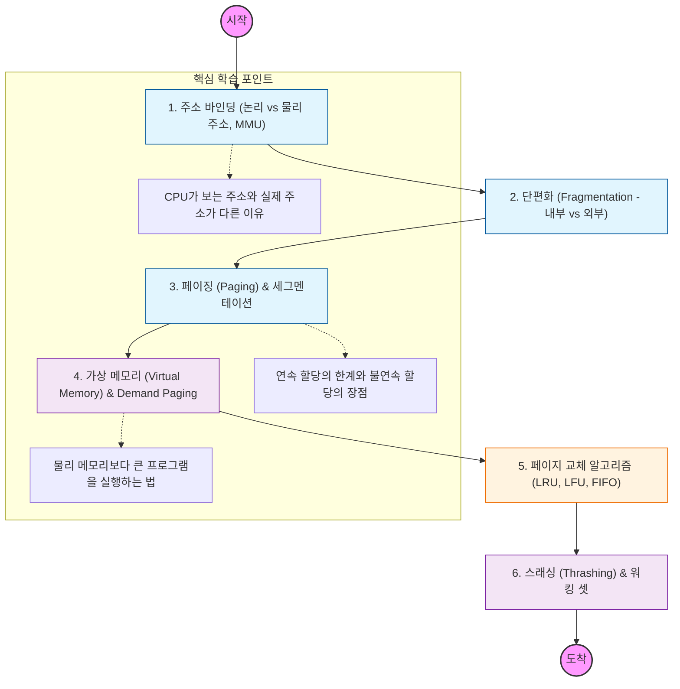

메모리 관리는 "한정된 물리 메모리를 어떻게 하면 수많은 프로세스에게 효율적이고 안전하게 나누어 줄 것인가"를 다루는 기술

---

## 🔍 단계별 필수 수행 지침

### **1. 주소 바인딩 및 MMU 구조 파악할 것**

- 논리적 주소(Virtual Address)가 하드웨어인 **MMU**를 통해 어떻게 물리적 주소로 변환되는지 그 과정을 완벽히 이해해야 함.
- 베이스 레지스터와 리미트 레지스터의 역할을 공부해야 함.

### **2. 단편화(Fragmentation) 해결책 제시할 것**

- 메모리를 연속적으로 할당했을 때 발생하는 **외부 단편화** 문제를 반드시 확인해야 함.
- 이를 해결하기 위해 메모리를 고정된 크기로 쪼개는 **페이징(Paging)** 기법을 집중적으로 학습해야 함.

### **3. 가상 메모리와 페이지 폴트(Page Fault) 이해해야 함**

- 프로그램 전체가 메모리에 올라가지 않아도 실행 가능한 이유인 **Demand Paging**을 공부해야 함.
- 페이지 폴트가 발생했을 때 OS가 디스크에서 데이터를 가져오는 과정을 순서대로 정리해야 함.

### **4. 페이지 교체 알고리즘 비교 분석해야 함**

- 메모리가 꽉 찼을 때 어떤 페이지를 쫓아낼지 결정하는 LRU(Least Recently Used)와 **LFU**의 차이를 명확히 구분해야 함.
- 특히 LRU가 실무(캐시 설계 등)에서 왜 가장 많이 쓰이는지 파악할 것.

### **5. 스래싱(Thrashing) 방지 대책 세울 것**

- CPU 이용률은 낮은데 페이지 폴트만 과하게 발생하여 시스템이 멈추는 **스래싱** 현상을 공부해야 함.
- 이를 막기 위한 **워킹 셋(Working Set)** 모델과 페이지 폴트 빈도 조절법을 학습해야 함.
