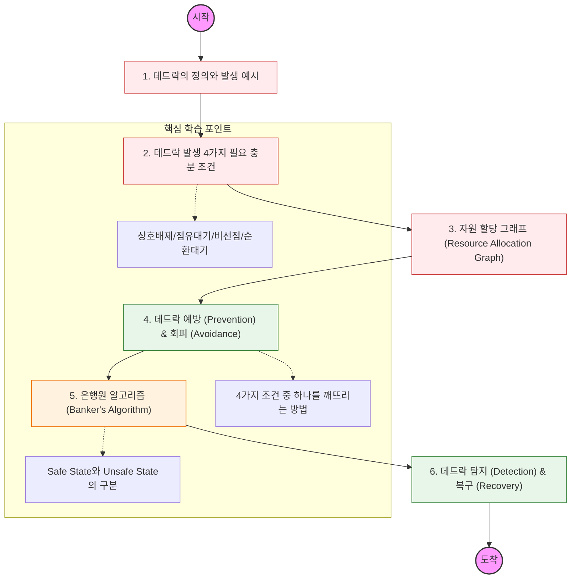

데드락은 "두 개 이상의 프로세스가 서로 상대방이 가진 자원을 기다리며 무한히 대기하는 상태"를 의미함. 이를 어떻게 정의하고, 예방하고, 해결할지 학습해야 함.

---

## 🔍 단계별 필수 수행 지침

### **1. 데드락 발생 4가지 조건을 암기하고 이해할 것**

- **상호 배제(Mutual Exclusion), 점유 대기(Hold and Wait), 비선점(No Preemption), 순환 대기(Circular Wait)** 이 4가지가 모두 충족되어야 데드락이 발생함을 파악해야 함.
- 각 조건이 실무 코드(예: DB Lock)에서 어떤 상황에 해당되는지 매칭해 볼 것.

### **2. 자원 할당 그래프 분석 능력을 갖출 것**

- 그래프에 사이클이 있다고 해서 무조건 데드락인지, 자원의 개수(Instance)에 따라 어떻게 달라지는지 구분할 줄 알아야 함.

### **3. 데드락 예방(Prevention)의 부작용을 파악할 것**

- 4가지 조건 중 하나를 거부하여 예방하는 방식이 시스템 효율성이나 자원 이용률을 얼마나 떨어뜨리는지 분석해야 함. (예: 점유 대기 부정 시 자원 낭비 문제 등)

### **4. 은행원 알고리즘(Banker's Algorithm)을 실습할 것**

- 회피(Avoidance) 전략의 핵심인 은행원 알고리즘의 동작 원리를 이해해야 함.
- 시스템이 **안전 상태(Safe State)**를 유지할 수 있는 경우에만 자원을 할당한다는 개념을 명확히 할 것.

### **5. 탐지(Detection) 및 복구(Recovery) 전략을 공부할 것**

- 데드락을 허용하되, 발생 시 이를 어떻게 찾아내고(그래프 탐색 등) 어떤 프로세스를 종료(Termination)시켜 복구할지 그 기준을 학습해야 함.
