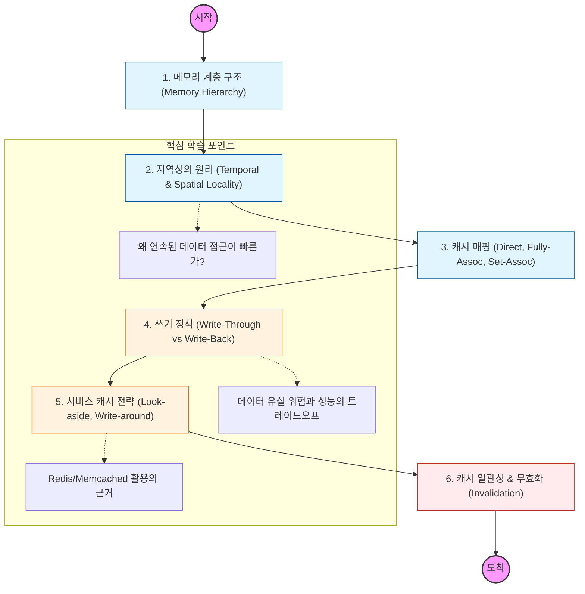

캐시는 "데이터를 미리 복사해 놓는 임시 장소"임. 지역성(Locality)의 원리를 이해하고, 데이터 일관성을 어떻게 유지할지가 핵심 학습 포인트임.

---

## 🔍 단계별 필수 수행 지침

### **1. 메모리 계층 구조의 경제성을 파악할 것**

- 레지스터, L1/L2/L3 캐시, RAM, SSD/HDD 간의 속도 및 비용 차이를 수치로 확인할 것.
- 위로 갈수록 빠르고 비싸며 용량이 적다는 특징을 이해해야 함.

### **2. 지역성(Locality)의 원리를 완벽히 이해해야 함**

- **시간 지역성:** 한 번 참조된 데이터는 곧 다시 참조될 확률이 높음.
- **공간 지역성:** 참조된 데이터 근처의 데이터가 참조될 확률이 높음.
- 이 원리가 어레이(Array) 순회 성능에 어떤 영향을 주는지 코드로 테스트해 볼 것.

### **3. 캐시 히트(Hit)와 미스(Miss)를 관리할 것**

- 캐시에 찾는 데이터가 있는 경우(Hit)와 없는 경우(Miss)의 처리 성능 차이를 공부해야 함.
- 캐시 미스 시 발생하는 **Penalty**를 줄이는 것이 시스템 튜닝의 목적임을 명심할 것.

### **4. 캐시 쓰기 정책(Write Policy)을 구분할 것**

- **Write-Through:** 캐시와 메모리에 동시에 씀 (정합성 높음, 성능 낮음).
- **Write-Back:** 캐시에만 먼저 쓰고 나중에 메모리에 반영함 (성능 높음, 데이터 유실 위험).
- 서비스의 특성에 따라 어떤 정책이 적합한지 판단 기준을 세울 것.

### **5. 캐시 일관성(Cache Coherence) 문제를 해결할 것**

- 여러 프로세서나 서버가 동일한 데이터를 캐싱할 때 발생하는 데이터 불일치 문제를 학습해야 함.
- **MESI 프로토콜** 같은 하드웨어 레벨의 해결책과, 어플리케이션 레벨의 **Cache Invalidation** 전략을 비교할 것.
