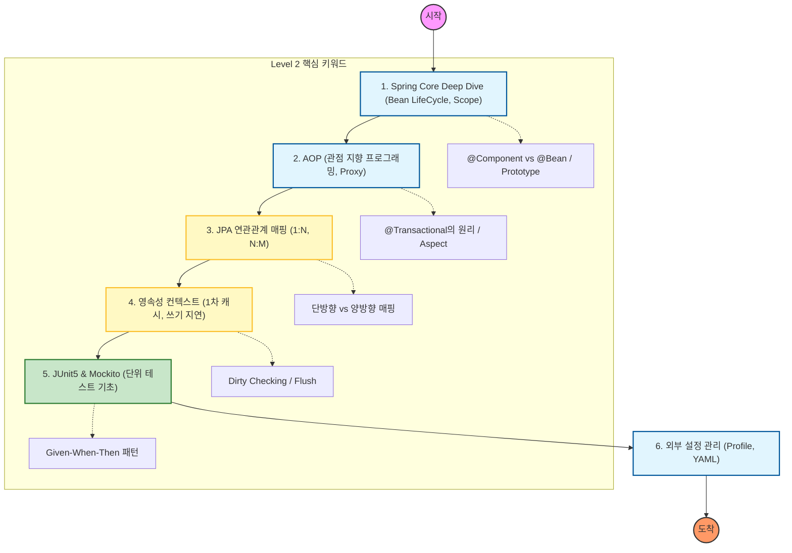

이 단계에서는 Spring의 3대 핵심 요소인 IoC, AOP, PSA를 이론과 실습으로 마스터하고, JPA를 통해 데이터를 제대로 다루는 법을 배워야 한다.

```mermaid
graph TD
    %% 스타일 정의
    classDef start fill:#f9f,stroke:#333,stroke-width:2px;
    classDef core fill:#e1f5fe,stroke:#01579b,stroke-width:2px;
    classDef data fill:#fff9c4,stroke:#fbc02d,stroke-width:2px;
    classDef test fill:#c8e6c9,stroke:#2e7d32,stroke-width:2px;
    classDef final fill:#f96,stroke:#333,stroke-width:2px;

    Start((시작)):::start --> SpringCore["1. Spring Core Deep Dive (Bean LifeCycle, Scope)"]:::core
    SpringCore --> AOP["2. AOP (관점 지향 프로그래밍, Proxy)"]:::core
    AOP --> DB_Mapping["3. JPA 연관관계 매핑 (1:N, N:M)"]:::data
    DB_Mapping --> Persistence["4. 영속성 컨텍스트 (1차 캐시, 쓰기 지연)"]:::data
    Persistence --> Test["5. JUnit5 & Mockito (단위 테스트 기초)"]:::test
    Test --> Config["6. 외부 설정 관리 (Profile, YAML)"]:::core
    Config --> Finish((도착)):::final

    %% 상세 키워드 연결
    subgraph "Level 2 핵심 키워드"
    SpringCore -.-> K1["@Component vs @Bean / Prototype"]
    AOP -.-> K2["@Transactional의 원리 / Aspect"]
    DB_Mapping -.-> K3["단방향 vs 양방향 매핑"]
    Persistence -.-> K4["Dirty Checking / Flush"]
    Test -.-> K5["Given-When-Then 패턴"]
    end
```
