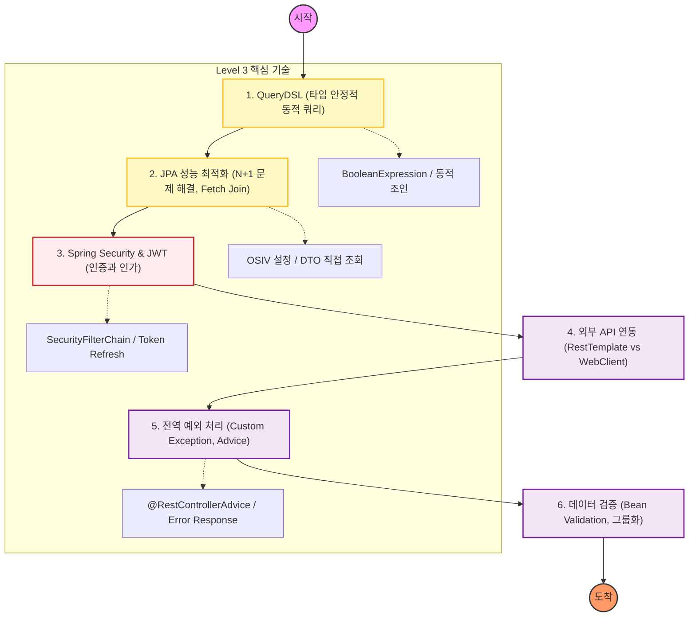

3단계의 키워드는 **안정성, 성능 최적화, 그리고 보안**

```mermaid
graph TD
    %% 스타일 정의
    classDef start fill:#f9f,stroke:#333,stroke-width:2px;
    classDef optimization fill:#fff9c4,stroke:#fbc02d,stroke-width:2px;
    classDef security fill:#ffebee,stroke:#c62828,stroke-width:2px;
    classDef infrastructure fill:#f3e5f5,stroke:#7b1fa2,stroke-width:2px;
    classDef final fill:#f96,stroke:#333,stroke-width:2px;

    Start((시작)):::start --> QueryDSL["1. QueryDSL (타입 안정적 동적 쿼리)"]:::optimization
    QueryDSL --> JPAOpt["2. JPA 성능 최적화 (N+1 문제 해결, Fetch Join)"]:::optimization
    JPAOpt --> Security["3. Spring Security & JWT (인증과 인가)"]:::security
    Security --> RestClient["4. 외부 API 연동 (RestTemplate vs WebClient)"]:::infrastructure
    RestClient --> Exception["5. 전역 예외 처리 (Custom Exception, Advice)"]:::infrastructure
    Exception --> Validation["6. 데이터 검증 (Bean Validation, 그룹화)"]:::infrastructure
    Validation --> Finish((도착)):::final

    %% 상세 키워드 연결
    subgraph "Level 3 핵심 기술"
    QueryDSL -.-> K1["BooleanExpression / 동적 조인"]
    JPAOpt -.-> K2["OSIV 설정 / DTO 직접 조회"]
    Security -.-> K3["SecurityFilterChain / Token Refresh"]
    Exception -.-> K4["@RestControllerAdvice / Error Response"]
    end
```
