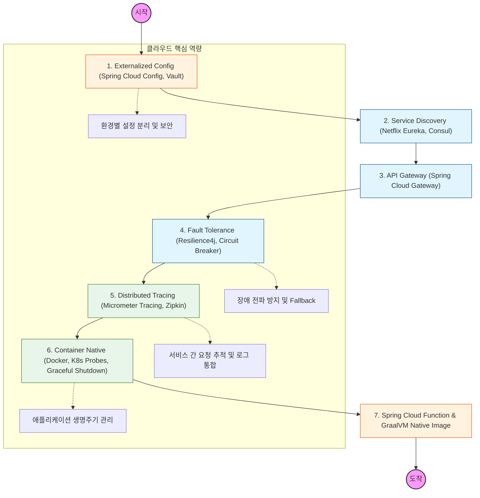

---

### 🔍 단계별 상세 학습 가이드

### **1단계: 외부 설정 관리 (Externalized Configuration)**

- **개념:** 서버를 재빌드하지 않고 DB 주소나 API 키 같은 설정을 변경하는 법.
- **학습 내용:** `Spring Cloud Config` 서버 구축, `Git` 레포지토리 연동, 민감 정보 암호화를 위한 `HashiCorp Vault` 활용.

### **2단계: 서비스 발견 및 라우팅 (Discovery & Gateway)**

- **개념:** 수십 개의 마이크로서비스가 서로의 위치(IP)를 자동으로 찾고, 클라이언트의 요청을 적절한 곳으로 배달하는 구조.
- **학습 내용:** `Netflix Eureka` 서버/클라이언트 설정, `Spring Cloud Gateway`를 이용한 공통 필터(인증, 로깅) 구현.

### **3단계: 장애 내구성 (Resilience & Fault Tolerance)**

- **개념:** 하나의 서비스가 죽었을 때 전체 시스템이 마비되지 않도록 차단기(Circuit Breaker)를 내리는 법.
- **학습 내용:** `Resilience4j`를 활용한 Circuit Breaker, Rate Limiter(요청 제한), Bulkhead(자원 격리) 패턴 적용.

### **4단계: 분산 추적 및 모니터링 (Observability)**

- **개념:** 여러 서버를 거쳐가는 하나의 요청이 어디서 병목이 생기는지 추적하는 법.
- **학습 내용:** `Micrometer Tracing`과 `Zipkin`을 이용한 트레이싱 ID 추적, `Spring Boot Actuator` 메트릭 수집.

### **5단계: 컨테이너 네이티브 (Container Native)**

- **개념:** 쿠버네티스 환경에 최적화된 스프링 애플리케이션 설계.
- **학습 내용:** `Liveness` 및 `Readiness` 프로브 설정, 종료 시 데이터 유실 방지를 위한 `Graceful Shutdown`, 도커 이미지 최적화(Layered Jar).

### **6단계: 서버리스 및 네이티브 이미지 (Next Generation)**

- **개념:** 기동 시간(Cold Start)을 획기적으로 줄여 서버리스 환경에 대응하는 법.
- **학습 내용:** `GraalVM` 기반의 `Spring Native` 이미지 빌드, `Spring Cloud Function`을 활용한 서버리스 아키텍처.
