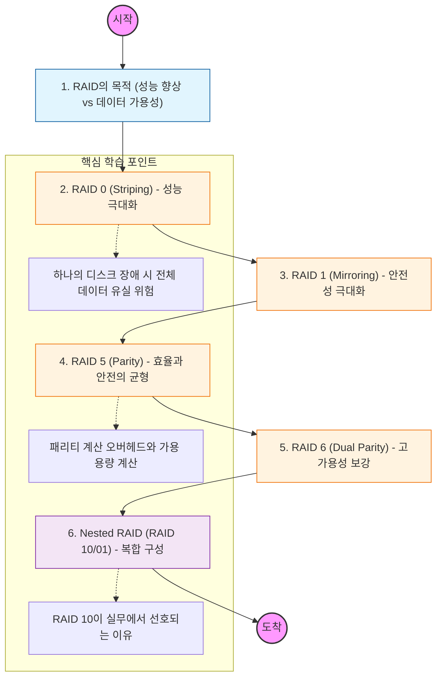

RAID는 "여러 개의 하드 디스크를 하나의 논리적인 디스크로 묶어 사용하는 기술"임. 데이터 분산 저장(Striping)과 복제(Mirroring)를 통해 성능과 신뢰성을 동시에 확보하는 것이 핵심임.

---

## 🔍 단계별 필수 수행 지침

### **1. RAID 0(Striping)의 위험성을 인지할 것**

- 데이터를 여러 디스크에 나누어 저장하여 읽기/쓰기 속도는 빠르지만, **결함 허용(Fault Tolerance)**이 전혀 없다는 점을 명심해야 함.
- 중요 데이터가 아닌 임시 작업 공간에만 사용해야 함을 이해할 것.

### **2. RAID 1(Mirroring)의 공간 효율성을 계산할 것**

- 동일한 데이터를 두 개 이상의 디스크에 복제함.
- 가용 용량이 전체 디스크 용량의 절반으로 줄어드는 비용 문제를 파악해야 함.
- 읽기 성능은 향상되나 쓰기 성능은 단일 디스크와 유사함을 이해할 것.

### **3. RAID 5의 패리티(Parity) 원리를 정복해야 함**

- 최소 3개의 디스크가 필요하며, 데이터와 함께 오류 복구용 패리티 정보를 분산 저장함.
- 디스크 하나가 고장 나도 데이터를 복구할 수 있는 원리와, **가용 용량($N-1$)** 공식을 숙지할 것.

### **4. RAID 6와 RAID 5의 차이점을 분석할 것**

- 패리티를 두 군데에 저장하여 **디스크 2개가 동시에 고장 나도** 버틸 수 있는 고가용성 구조임.
- 쓰기 오버헤드가 RAID 5보다 크다는 점을 학습해야 함.

### **5. RAID 10(1+0)의 구조를 도식화할 것**

- RAID 1(미러링)로 묶은 그룹들을 다시 RAID 0(스트라이핑)으로 묶는 방식임.
- 속도와 안전성을 모두 잡은 방식으로, 대규모 DB 서버 등 실무에서 가장 많이 선호되는 이유를 기술할 것.
