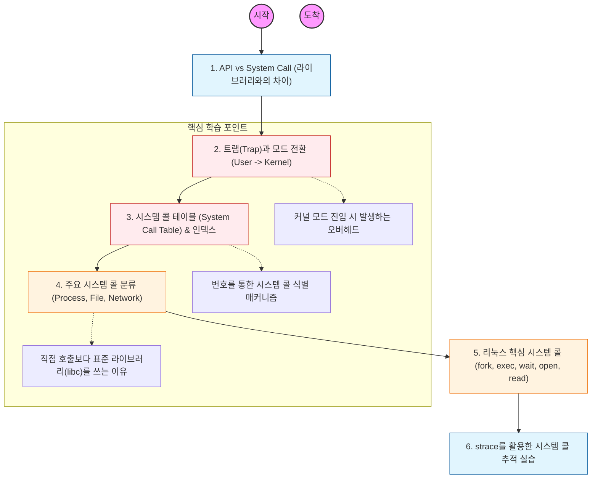

시스템 콜은 "사용자 모드 프로세스가 커널에 서비스를 요청하는 메커니즘"임. 단순히 함수 호출이 아니라 CPU의 실행 모드가 바뀌는 거대한 전환 과정임을 이해하는 것이 핵심

---

## 🔍 단계별 필수 수행 지침

### **1. API와 시스템 콜의 계층 구조를 파악할 것**

- 자바의 `FileInputStream`이나 C의 `fopen()`은 직접 시스템 콜이 아님.
- 이들이 내부적으로 표준 라이브러리(Glibc 등)를 거쳐 실제 시스템 콜인 `open()`을 호출하는 계층 구조를 이해해야 함.

### **2. 트랩(Trap) 및 인터럽트 과정을 분석할 것**

- 시스템 콜이 발생하면 CPU는 하드웨어적으로 **트랩(소프트웨어 인터럽트)**을 발생시킴.
- 이 과정에서 레지스터 값이 저장되고 커널 모드로 진입하는 '컨텍스트 스위칭' 오버헤드를 인지할 것.

### **3. 시스템 콜 번호와 인덱싱 원리를 이해해야 함**

- 커널은 각각의 시스템 콜에 고유 번호를 부여함 (예: 리눅스 x86_64에서 `read`는 0번, `write`는 1번).
- CPU 레지스터에 번호를 싣고 커널에 진입하면, 커널이 **시스템 콜 테이블**을 참조하여 해당 루틴을 실행하는 과정을 공부할 것.

### **4. 리눅스 5대 시스템 콜을 완벽히 숙지할 것**

- **fork():** 현재 프로세스를 복제하여 자식 프로세스 생성.
- **exec():** 새로운 프로그램을 현재 프로세스 메모리에 덮어씌워 실행.
- **wait():** 자식 프로세스가 종료될 때까지 대기.
- **open()/read()/write():** 파일 및 장치 I/O 처리.
- **mmap():** 파일을 메모리에 매핑하여 성능 최적화.

### **5. `strace` 도구를 직접 사용하여 실습할 것**

- 리눅스 환경에서 `strace ls`나 `strace java Main`을 실행하여, 프로그램이 실행되는 동안 커널에 어떤 시스템 콜을 던지는지 눈으로 직접 확인할 것.
