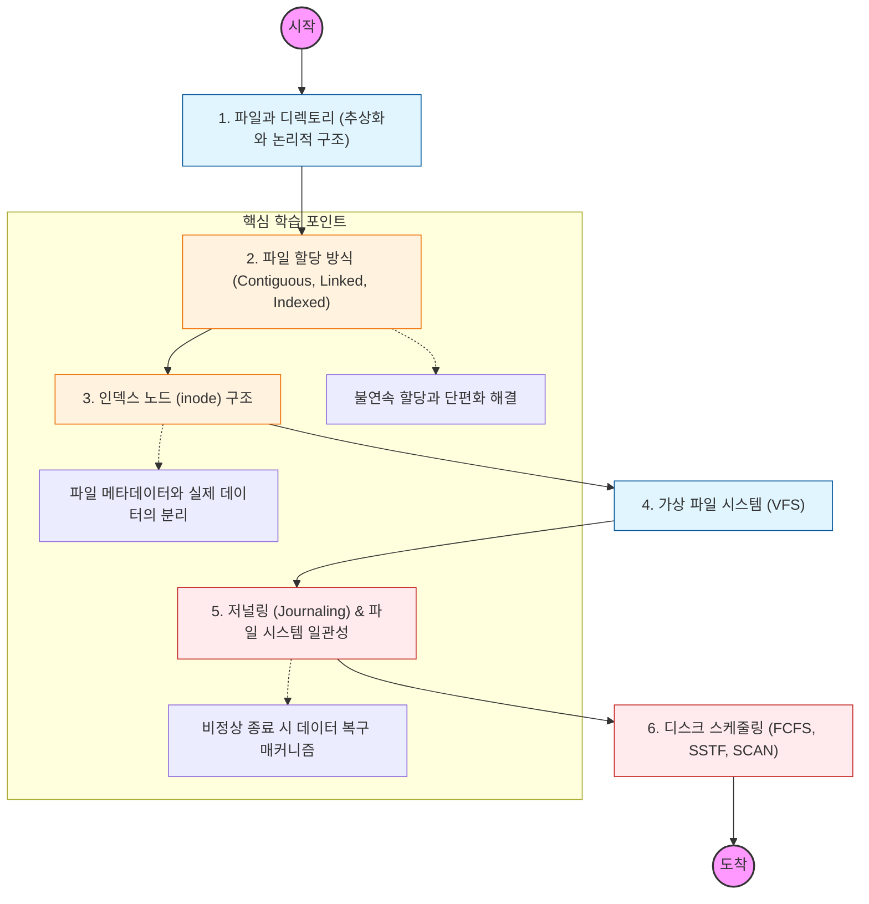

파일 시스템은 "데이터에 이름을 붙이고, 이를 저장하고 관리하는 논리적 구조"임. 물리적인 섹터 단위의 데이터를 파일이라는 추상화된 단위로 다루는 법을 배워야 함.

---

## 🔍 단계별 필수 수행 지침

### **1. 파일 할당 방식의 트레이드오프를 파악할 것**

- **연속 할당(Contiguous):** 속도는 빠르지만 외부 단편화 발생.
- **연결 할당(Linked):** 단편화는 없지만 탐색 속도가 느리고 포인터 유실 시 위험함.
- **인덱스 할당(Indexed):** 인덱스 블록을 통해 직접 접근 가능. 리눅스 inode의 모태가 됨.

### **2. 리눅스 inode(Index Node) 구조를 완벽히 이해해야 함**

- 파일 이름은 디렉토리가 가지고 있고, 실제 파일 정보(권한, 크기, 위치)는 **inode**가 관리함을 명심할 것.
- `ls -i` 명령어로 파일의 inode 번호를 확인하고, 하드 링크(Hard Link)와 심볼릭 링크(Symbolic Link)의 차이를 inode 관점에서 설명할 수 있어야 함.

### **3. 가상 파일 시스템(VFS)의 역할을 공부할 것**

- 사용자가 EXT4, NTFS, NFS 등 서로 다른 파일 시스템을 사용하더라도 동일한 시스템 콜(`read`, `write`)로 접근할 수 있게 해주는 추상화 계층임.
- "Everything is a file" 철학이 VFS를 통해 어떻게 구현되는지 파악할 것.

### **4. 저널링(Journaling) 기법을 정복해야 함**

- 데이터를 쓰기 전에 로그(Journal)에 먼저 기록하여, 갑작스러운 전원 차단 시에도 파일 시스템의 정합성을 유지하는 원리를 학습해야 함.
- 현대적인 파일 시스템(EXT4, XFS 등)이 왜 저널링을 필수로 사용하는지 이해할 것.

### **5. 디스크 스케줄링 알고리즘을 분석할 것**

- 디스크 헤더의 이동 거리를 최소화하기 위한 **SSTF**, 엘리베이터 알고리즘인 **SCAN** 등의 원리를 학습할 것.
- SSD 시대에 들어서면서 이러한 기계적 스케줄링의 의미가 어떻게 변했는지도 함께 고민해 볼 것.
