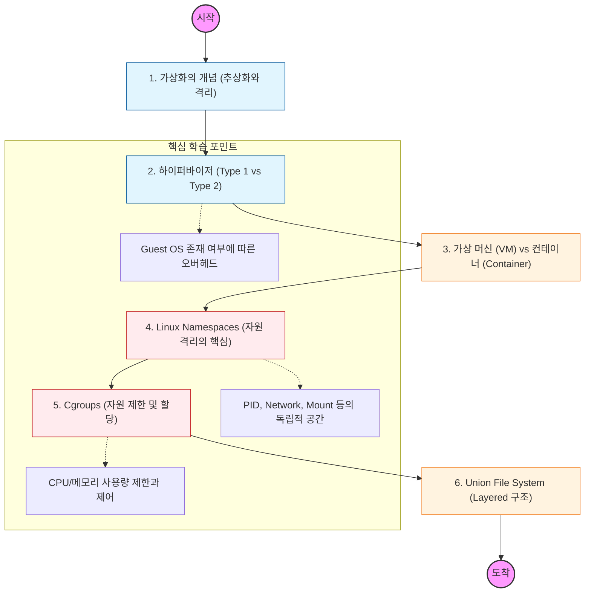

가상화는 "물리적 자원을 논리적으로 분리하여 효율성을 극대화하는 기술"임. 커널을 공유하느냐, 별도의 OS를 띄우느냐에 따른 기술적 차이를 파헤쳐야 함.

---

## 🔍 단계별 필수 수행 지침

### **1. 하이퍼바이저(Hypervisor) 구조를 파악할 것**

- **Type 1 (Bare-metal):** 하드웨어 위에서 직접 실행 (Xen, KVM).
- **Type 2 (Hosted):** 호스트 OS 위에서 어플리케이션으로 실행 (VirtualBox, VMware).
- 하드웨어 지원 가상화(Intel VT-x)가 왜 필요한지 이해해야 함.

### **2. VM과 컨테이너의 차이를 도식화하여 비교할 것**

- **VM:** 하드웨어 수준의 가상화. Guest OS가 필요하며 무겁고 느림.
- **Container:** 운영체제 수준의 가상화. 호스트 커널을 공유하며 가볍고 빠름.
- 왜 컨테이너가 마이크로서비스 아키텍처(MSA)에 적합한지 기술적 근거를 제시할 것.

### **3. 리눅스 네임스페이스(Namespaces) 기능을 정복해야 함**

- 컨테이너가 독립적인 시스템처럼 보이는 마법의 정체임.
- **uts** (호스트명), **pid** (프로세스 ID), **net** (네트워크), **mnt** (파일시스템 마운트) 등의 격리 원리를 학습할 것.

### **4. Cgroups(Control Groups)의 제어 능력을 학습할 것**

- 특정 컨테이너가 호스트의 CPU나 메모리를 독점하지 못하게 막는 기술임.
- 쿠버네티스의 리소스 제한(`limits`, `requests`)이 내부적으로 어떻게 Cgroups로 구현되는지 파악할 것.

### **5. Union File System과 이미지 레이어 구조를 이해할 것**

- 여러 개의 레이어를 겹쳐서 하나의 파일시스템으로 보여주는 원리임.
- 도커 이미지가 왜 레이어 단위로 캐싱되는지, 왜 저장 공간을 효율적으로 쓰는지 분석할 것.
