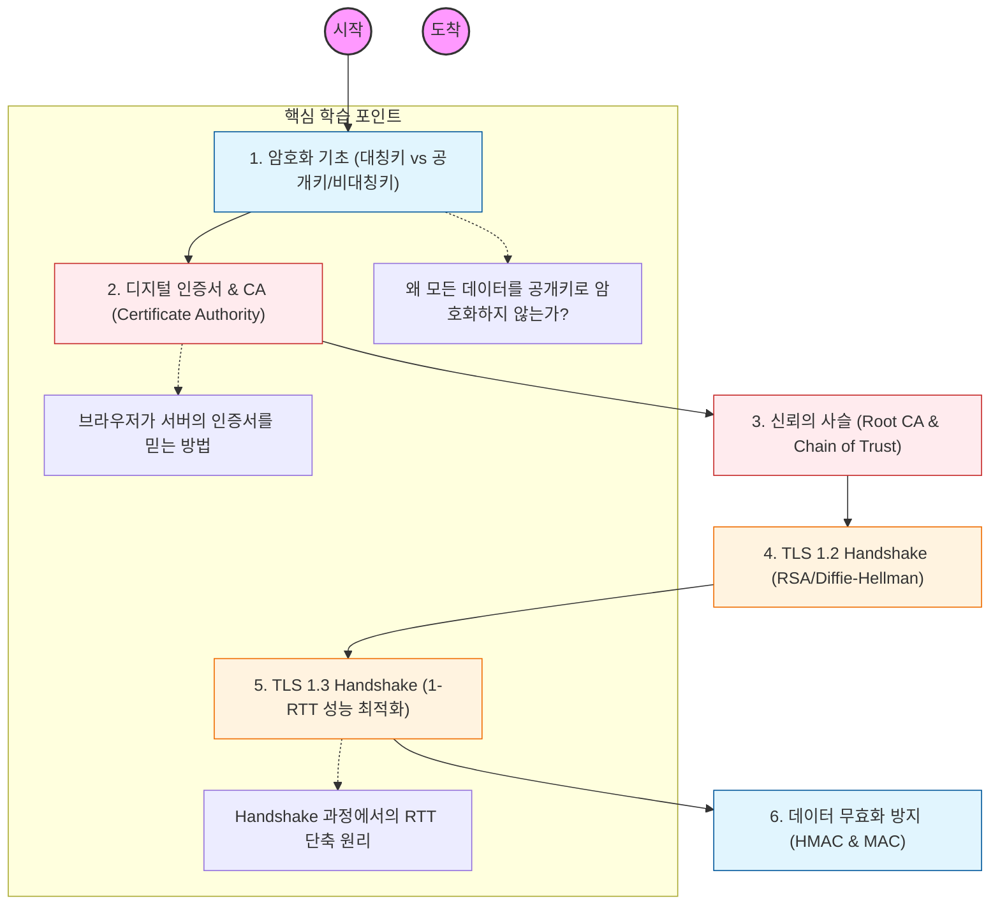

HTTPS는 HTTP에 TLS(Transport Layer Security) 프로토콜을 얹어 보안을 강화한 것임. 데이터가 탈취되더라도 내용을 알 수 없게 만드는 것이 핵심임.

---

## 🔍 단계별 필수 수행 지침

### **1. 대칭키와 비대칭키의 혼합 방식을 파악할 것**

- **대칭키:** 빠르지만 키 전달이 어려움.
- **비대칭키(공개키):** 키 전달은 안전하지만 연산이 매우 느림.
- 실제 데이터는 대칭키로 암호화하고, 그 대칭키를 비대칭키로 주고받는 **하이브리드 암호 시스템**을 반드시 이해해야 함.

### **2. 인증서와 CA의 역할을 공부할 것**

- 서버가 보내준 공개키가 진짜 그 서버의 것인지 어떻게 보증하는지 확인해야 함.
- 신뢰할 수 있는 기관인 **CA**가 서버의 공개키를 자신의 비밀키로 서명하는 과정을 학습할 것.
- 브라우저에 미리 설치된 **Root CA** 리스트와 '신뢰의 사슬' 개념을 파악할 것.

### **3. TLS 1.2 Handshake 과정을 도식화할 것**

- `Client Hello` -> `Server Hello` -> `Certificate` -> `Key Exchange` -> `Change Cipher Spec` 등 복잡한 왕복 과정을 순서대로 정리해야 함.
- 이 과정에서 어떻게 세션 키(Session Key)가 안전하게 생성되는지 파악할 것.

### **4. TLS 1.3의 혁신적인 변화를 분석할 것**

- TLS 1.2의 복잡한 절차를 생략하고 단 1번의 왕복(**1-RTT**)으로 연결을 맺는 원리를 공부해야 함.
- 보안이 취약한 오래된 암호화 알고리즘들이 어떻게 퇴출되었는지 인지할 것.

### **5. HTTPS의 부가적인 이점을 학습할 것**

- 단순히 암호화뿐만 아니라, 데이터가 중간에 변조되지 않았음을 보장하는 무결성(Integrity)과 접속한 서버가 진짜임을 확인하는 **인증(Authentication)** 기능을 이해해야 함.
- 검색 엔진 최적화(SEO)와 HTTP/2, HTTP/3 사용을 위해 HTTPS가 왜 필수인지 파악할 것.
