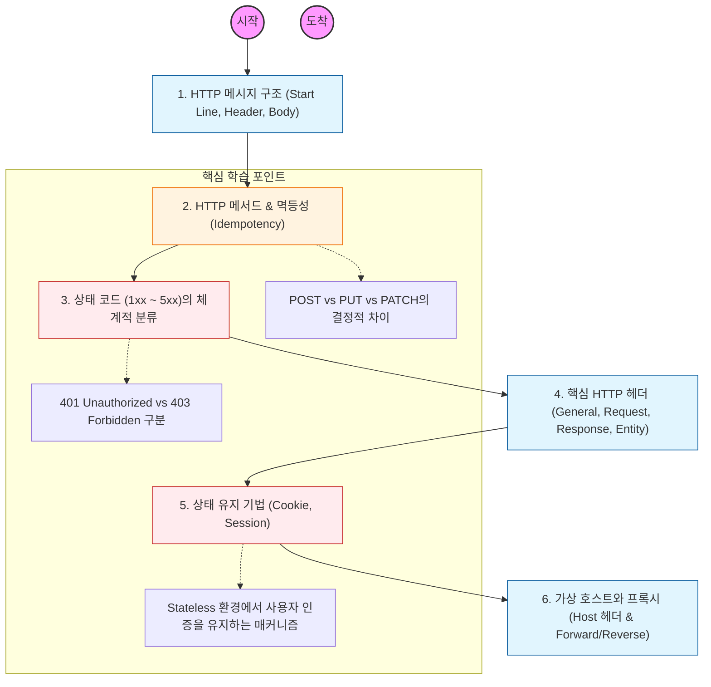

HTTP는 단순히 텍스트를 주고받는 규약을 넘어, 웹의 모든 자원을 정의하고 소유권과 상태를 관리하는 거대한 프레임워크임.

---

## 🔍 단계별 필수 수행 지침

### 1. HTTP 메시지 포맷의 텍스트 기반 구조를 파악할 것

- 요청(Request)과 응답(Response) 메시지가 어떻게 구성되는지 줄 단위로 뜯어봐야 함.
- 특히 Header와 Body 사이의 빈 줄(CRLF)이 데이터를 구분하는 결정적인 경계임을 인지할 것.

### 2. 메서드의 특성(안전성, 멱등성)을 기술적으로 정의할 것

- **Safe Methods:** 서버의 상태를 변경하지 않는 메서드 (GET, HEAD).
- **Idempotent Methods:** 여러 번 수행해도 결과가 같은 메서드 (GET, PUT, DELETE).
- **POST와 PATCH의 차이:** 리소스를 새로 생성하는지, 혹은 부분적으로 수정하는지에 따른 설계 차이를 학습할 것.

### 3. 상태 코드(Status Code)별 대응 전략을 수립할 것

- **2xx (Success):** 200(OK) 외에도 201(Created), 204(No Content)의 사용처 파악.
- **3xx (Redirection):** 301(Permanent)과 302(Found)가 SEO에 미치는 영향 분석.
- **4xx vs 5xx:** 클라이언트 잘못인지 서버 잘못인지 명확히 구분하여 API 에러 응답을 설계할 것.

### 4. 핵심 HTTP 헤더의 역할을 정복해야 함

- **Content-Type & Content-Length:** 바디 데이터를 해석하는 기준.
- **Host:** 하나의 IP에서 여러 도메인을 운영하는 가상 호스트의 핵심.
- **User-Agent & Referer:** 요청의 출처와 브라우저 정보를 파악하는 법.
- **Accept:** 클라이언트가 원하는 데이터 형식(Content Negotiation)을 지정하는 법.

### 5. 무상태성(Stateless)을 극복하는 쿠키와 세션을 이해할 것

- **Cookie:** 클라이언트에 저장되는 키-값 쌍. 보안 옵션(`HttpOnly`, `Secure`, `SameSite`)을 반드시 공부할 것.
- **Session:** 서버 메모리나 DB에 상태를 저장하고, 쿠키에는 **Session ID**만 담아 전달하는 흐름을 파악할 것.
- 세션의 확장성 문제(Server Clustering)를 어떻게 해결하는지(Session Clustering, Redis) 연결하여 생각할 것
