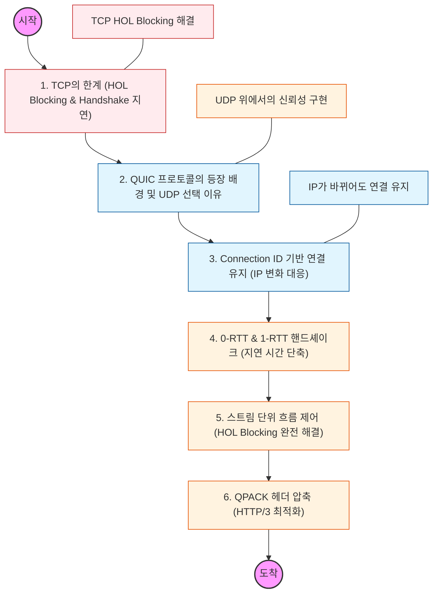

HTTP/3는 전송 계층에서 TCP 대신 UDP 기반의 **QUIC(Quick UDP Internet Connections)** 프로토콜을 사용하여 지연 시간을 줄이고 연결 안정성을 높인 차세대 규격입니다.

---

## 🔍 단계별 필수 수행 지침

### 1. TCP HOL(Head-of-Line) Blocking 문제를 완벽히 이해할 것

- HTTP/2가 하나의 TCP 연결에서 여러 스트림을 전송하더라도, 패킷 유실 시 전체 스트림이 멈추는 이유를 분석하십시오.
- 이 문제가 네트워크 계층(L4)의 특성에서 비롯됨을 인지하고, HTTP/3가 이를 어떻게 독립적인 스트림으로 분리했는지 학습하십시오.

### 2. QUIC이 UDP를 선택한 공학적 이유를 분석할 것

- TCP는 커널에 내장되어 수정이 매우 어렵지만, UDP는 데이터 전달만 담당하므로 사용자 공간(User Space)에서 새로운 기능을 빠르게 구현할 수 있다는 장점을 파악하십시오.
- "UDP는 신뢰성이 없다"는 편견을 버리고, QUIC이 UDP 위에서 어떻게 자체적으로 패킷 재전송과 순서 보장을 구현했는지 확인하십시오.

### 3. 0-RTT 및 1-RTT 핸드셰이크의 원리를 파악할 것

- TLS 1.3과 통합된 QUIC 핸드셰이크 과정을 학습하십시오.
- 재접속 시 데이터와 인증 정보를 동시에 보내는 **0-RTT** 기법이 어떻게 지연 시간을 극한으로 줄이는지 도식화하십시오.

### 4. Connection ID를 통한 '연결 이동성(Mobility)'을 이해할 것

- IP 주소나 포트가 바뀌면 끊기는 TCP와 달리, 고유한 **Connection ID**를 사용하여 Wi-Fi에서 5G로 전환되어도 통신이 끊기지 않는 원리를 학습하십시오.
- 모바일 환경에서 이 기능이 사용자 경험에 어떤 영향을 주는지 인지하십시오.

### 5. QPACK 헤더 압축 알고리즘을 학습할 것

- HTTP/2의 HPACK이 가진 순서 의존성을 해결하기 위해 등장한 **QPACK**의 차이점을 분석하십시오.
- 헤더 압축 데이터가 유실되어도 다른 패킷 해석에 영향을 주지 않는 구조를 이해하십시오.
