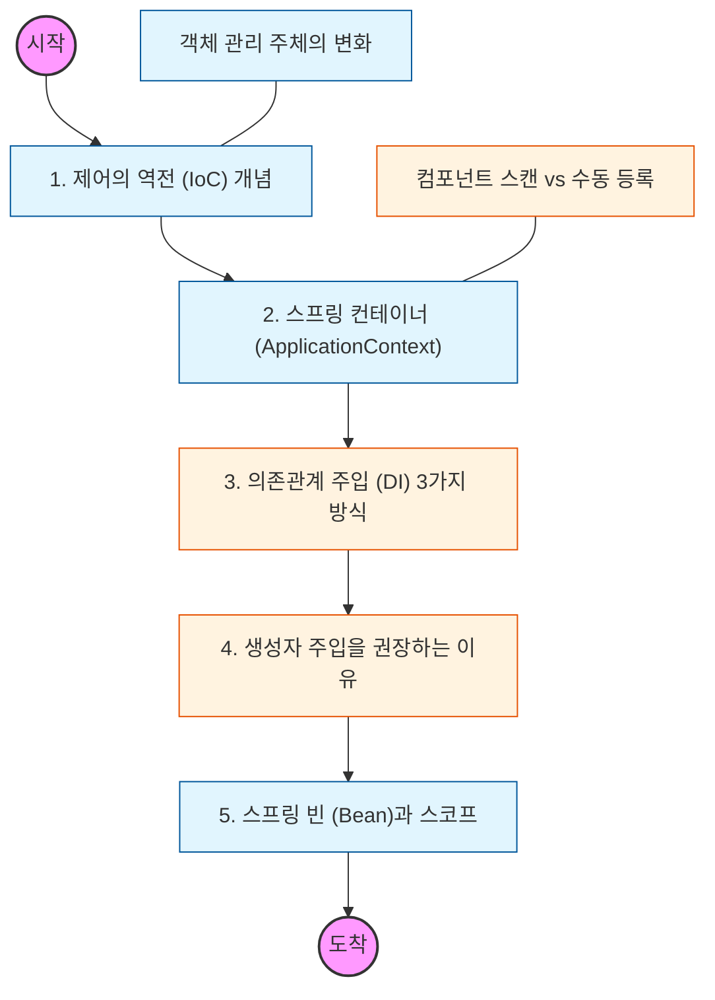

# 🧭 IoC와 DI: 스프링의 심장

> **해당 학습의 목표:** 객체의 생성과 관리 권한을 프레임워크에 넘김으로써 얻는 유연성과, '결합도'를 낮추는 의존관계 주입의 원리를 이해함.

---

## 🛣️ Learning Roadmap

---

## 🔍 상세 학습 가이드

### **1. 제어의 역전 (IoC, Inversion of Control)**

* **내용:** 개발자가 직접 객체를 생성하고 관리하던 흐름을 스프링 컨테이너가 대신 관리하도록 주도권을 넘기는 것임.
* **Why?** 객체 생명주기 관리 권한을 프레임워크에 위임함으로써 결합도를 낮추고 비즈니스 로직에만 집중해야 함.

### **2. 스프링 컨테이너와 빈 (Bean)**

* **내용:** ApplicationContext가 설정 정보를 참고하여 빈을 생성, 조립, 관리하는 원리를 파악함.
* **핵심:** 싱글톤 패턴을 직접 구현하지 않아도 컨테이너가 객체를 싱글톤으로 관리하여 메모리 효율을 높이는 점을 이해해야 함.

### **3. 의존관계 주입 (DI, Dependency Injection) 방식**

* **내용:** 생성자 주입, 수정자(Setter) 주입, 필드 주입의 기술적 차이를 학습함.
* **핵심:** 불변성 보장과 테스트 용이성을 위해 **생성자 주입**을 사용하는 것이 표준임을 인지해야 함.

### **4. 컴포넌트 스캔과 자동 주입**

* **내용:** `@Component` 계열 어노테이션을 통해 빈이 자동으로 등록되는 과정을 공부함.
* **체크리스트:** 동일한 타입의 빈이 중복될 때 발생하는 예외와 이를 해결하는 `@Qualifier`, `@Primary` 사용법을 익혀야 함.

### **5. 빈 스코프 (Bean Scope)**

* **내용:** Singleton, Prototype, Request 등 빈의 생존 범위를 결정하는 스코프의 개념을 정리함.
* **상황:** 각 스코프가 생성되고 소멸하는 시점을 정확히 구분하여 설계에 반영해야 함.