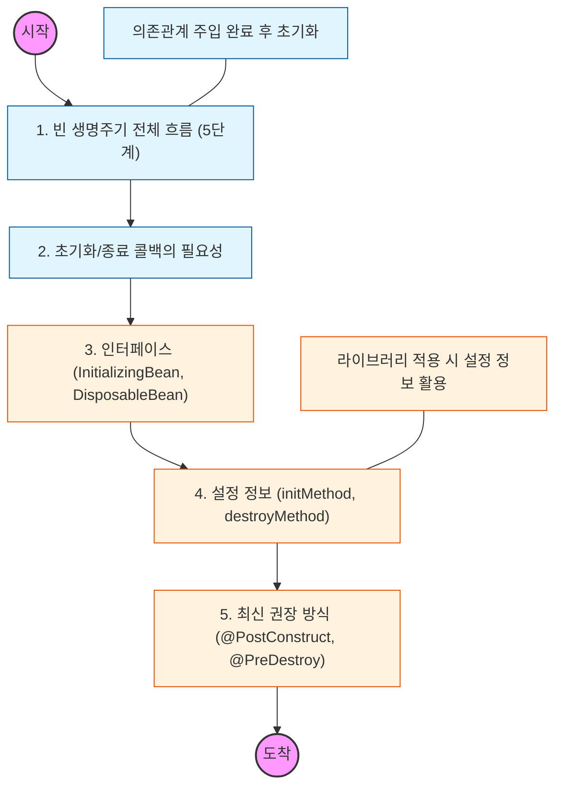

# 🧭 빈 생명주기와 콜백

> **해당 학습의 목표:** 스프링 빈이 생성되고 소멸하기까지의 전체 과정을 이해하고, 특정 시점에 비즈니스 로직(연결, 해제 등)을 실행하는 방법을 학습함.

---

## 🛣️ Learning Roadmap

---

## 🔍 상세 학습 가이드

### **1. 빈 생명주기 전체 흐름**

* **내용:** `스프링 컨테이너 생성` -> `스프링 빈 생성` -> `의존관계 주입` -> `초기화 콜백` -> `사용` -> `소멸 전 콜백` -> `스프링 종료` 순서를 숙지함.
* **핵심:** 객체 생성과 의존관계 주입이 완료된 **후**에야 비로소 데이터를 사용할 준비가 된다는 점을 명확히 인지해야 함.

### **2. 초기화 및 종료 콜백의 필요성**

* **내용:** 데이터베이스 커넥션 풀이나 네트워크 소켓처럼 시작 시 연결하고 종료 시 해제해야 하는 자원 관리 방법을 공부함.
* **Why?** 생성자에서 무거운 초기화 작업을 수행하는 것보다, 객체 생성과 초기화를 분리하는 것이 유지보수 측면에서 유리함을 이해해야 함.

### **3. @PostConstruct, @PreDestroy (권장 방식)**

* **내용:** 최신 스프링에서 가장 권장하는 어노테이션 기반 콜백 방식을 학습함.
* **핵심:** 자바 표준(JSR-250) 라이브러리이므로 스프링이 아닌 다른 컨테이너에서도 동작하며, 컴포넌트 스캔과 잘 어울리는 장점을 파악해야 함.

### **4. 빈 설정 정보의 초기화/종료 메서드 지정**

* **내용:** `@Bean(initMethod = "init", destroyMethod = "close")`와 같이 수동으로 등록하는 방법을 익힘.
* **상황:** 코드를 수정할 수 없는 외부 라이브러리를 빈으로 등록하고 초기화/종료 메서드를 호출해야 할 때 이 방식을 사용해야 함.

### **5. 종료 메서드 추론 (Inferred)**

* **특징:** `@Bean`의 `destroyMethod`는 기본값이 `(inferred)`(추론)로 설정되어 있어, `close`나 `shutdown`이라는 이름의 메서드를 자동으로 호출해주는 기능을 이해해야 함.

---

## 🔗 관련 참고 자료

* [Spring 공식 문서 - Customizing the Nature of a Bean](https://docs.spring.io/spring-framework/reference/core/beans/factory-nature.html)