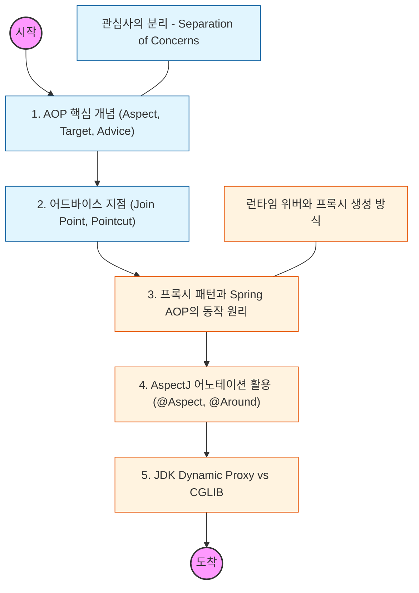

# 🧭 Spring AOP: 관점 지향 프로그래밍

> **해당 학습의 목표:** 핵심 비즈니스 로직과 공통 부가 기능을 분리하여 코드의 재사용성과 유지보수성을 극대화하는 방법을 학습함.

---

## 🛣️ Learning Roadmap

---

## 🔍 상세 학습 가이드

### **1. AOP의 핵심 용어 정복**

* **내용:** Aspect(공통 기능), Target(적용 대상), Advice(언제 수행할지), Join Point(적용 가능 지점), Pointcut(실제 적용 지점)의 개념을 명확히 정리함.
* **Why?** OOP의 한계를 보완하여 여러 클래스에 걸쳐 있는 '횡단 관심사(Cross-cutting Concerns)'를 한곳에서 관리해야 함.

### **2. Advice의 종류와 실행 시점**

* **내용:** `@Before`, `@After`, `@AfterReturning`, `@AfterThrowing`, `@Around` 각각의 실행 타이밍을 파악함.
* **핵심:** 가장 강력한 `@Around`가 타겟 메서드의 실행 여부와 리턴값까지 제어할 수 있음을 인지해야 함.

### **3. 프록시(Proxy) 기반 AOP 동작 원리**

* **내용:** 스프링이 타겟 객체를 직접 호출하는 대신, 가짜 객체(Proxy)를 앞에 세워 부가 기능을 먼저 수행하는 구조를 이해함.
* **핵심:** 프록시를 통하지 않고 객체 내부에서 메서드를 호출할 경우(Self-invocation), AOP가 적용되지 않는 한계를 반드시 파악해야 함.

### **4. 포인트컷 표현식 (Pointcut Expression)**

* **내용:** `execution(* com.example.service.*.*(..))`와 같이 특정 메서드를 정교하게 선택하는 문법을 익힘.
* **Why?** 원치 않는 곳에 공통 로직이 실행되지 않도록 정확한 범위를 지정하는 능력을 길러야 함.

### **5. JDK Dynamic Proxy와 CGLIB의 차이**

* **내용:** 인터페이스 유무에 따라 스프링이 프록시를 생성하는 방식이 어떻게 달라지는지 분석함.
* **상황:** 구체 클래스에만 의존할 때 CGLIB이 상속을 통해 프록시를 만드는 방식과 그로 인한 제약(final 메서드 등)을 이해해야 함.

---

## 🔗 관련 참고 자료

* [Spring 공식 문서 - Aspect Oriented Programming with Spring](https://docs.spring.io/spring-framework/reference/core/aop.html)