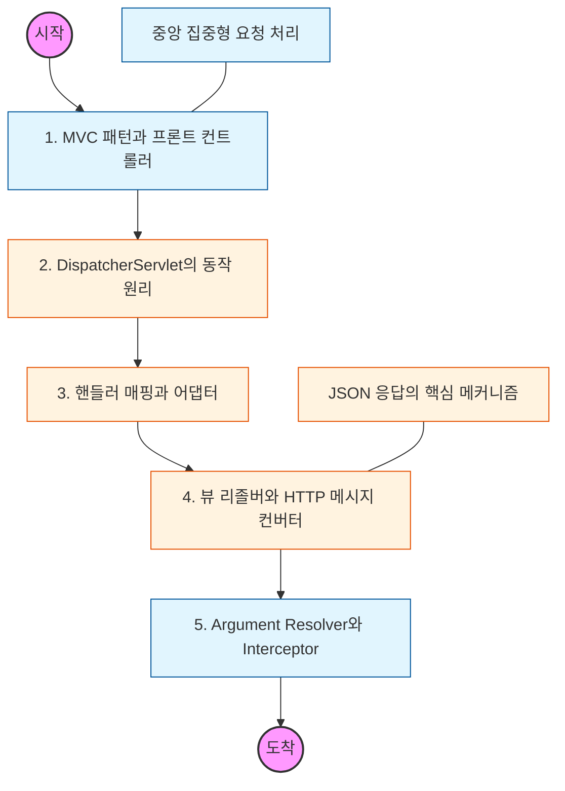

# 🧭 Spring MVC: 웹 요청 처리 아키텍처

> **해당 학습의 목표:** 클라이언트의 HTTP 요청이 컨트롤러에 도달하고 응답이 나가기까지의 전체 내부 동작 과정을 완벽히 파악해야 함.

---

## 🛣️ Learning Roadmap

---

## 🔍 상세 학습 가이드

### **1. 프론트 컨트롤러(Front Controller) 패턴**

* **내용:** 수많은 서블릿을 각각 만드는 대신, 하나의 입구(DispatcherServlet)에서 모든 요청을 받아 공통 처리를 수행하는 구조를 이해해야 함.
* **Why?** 공통 로직(로그, 인증, 다국어 처리 등)의 중복을 제거하고 개발자는 개별 비즈니스 로직(컨트롤러)에만 집중하도록 설계해야 함.

### **2. DispatcherServlet의 7단계 동작 흐름**

* **내용:** `핸들러 조회` -> `핸들러 어댑터 조회` -> `핸들러 실행` -> `ModelAndView 반환` -> `뷰 리졸버 호출` -> `뷰 반환` -> `렌더링` 과정을 도식화하여 암기해야 함.
* **핵심:** 스프링 MVC의 유연성이 인터페이스(HandlerMapping, HandlerAdapter 등)를 통해 구현됨을 파악해야 함.

### **3. HTTP 메시지 컨버터 (HttpMessageConverter)**

* **내용:** `@ResponseBody`나 `HttpEntity`를 사용할 때, 뷰를 통하지 않고 객체를 JSON이나 문자로 직접 응답하는 방식을 학습해야 함.
* **Why?** 현대적인 REST API 설계에서 객체를 JSON으로 변환하는 Jackson 라이브러리가 어떻게 메시지 컨버터와 통합되는지 이해해야 함.

### **4. Argument Resolver와 핸들러 어댑터**

* **내용:** 컨트롤러 파라미터로 넘겨받는 `@RequestParam`, `@ModelAttribute`, `@RequestBody` 등이 어떻게 가공되어 전달되는지 그 마법의 원리를 파악해야 함.
* **핵심:** 필요에 따라 커스텀 Argument Resolver를 만들어 중복된 세션 확인이나 인증 정보 추출 로직을 자동화할 수 있어야 함.

### **5. 인터셉터(Interceptor)와 서블릿 필터(Filter)**

* **내용:** 요청의 전/후 처리를 담당하는 필터와 인터셉터의 기술적 차이와 실행 순서를 구분해야 함.
* **상황:** 웹 전반의 보안 처리는 필터에서, 스프링 컨텍스트 내의 비즈니스 인증 처리는 인터셉터에서 수행하는 적절한 선택 기준을 세워야 함.

---

## 🔗 관련 참고 자료

* [Spring 공식 문서 - Web Servlet Framework](https://docs.spring.io/spring-framework/reference/web/webmvc.html)