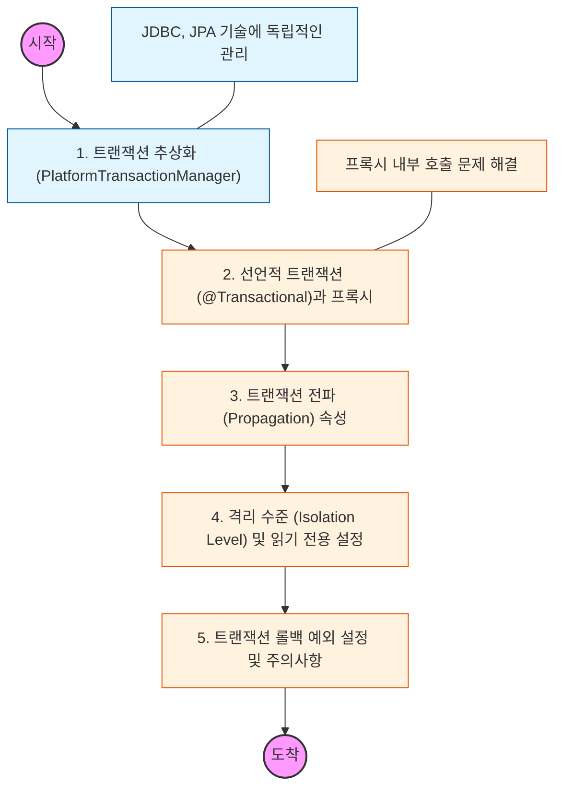

# 🧭 Spring Transaction: 데이터 정합성 관리

> **해당 학습의 목표:** `@Transactional`이 내부적으로 어떻게 동작하는지 이해하고, 복잡한 비즈니스 상황에서 트랜잭션 전파 및 격리 수준을 적절히 설정할 수 있어야 함.

---

## 🛣️ Learning Roadmap

---

## 🔍 상세 학습 가이드

### **1. 트랜잭션 추상화와 리소스 동기화**

* **내용:** 스프링이 제공하는 `PlatformTransactionManager` 인터페이스를 통해 JDBC, JPA, Hibernate 등 다양한 기술을 동일한 방식으로 처리하는 원리를 이해해야 함.
* **Why?** 기술이 바뀌어도 비즈니스 로직(서비스 계층)의 트랜잭션 코드가 변하지 않도록 추상화된 계층을 활용해야 함.

### **2. @Transactional의 동작 원리 (AOP)**

* **내용:** 스프링이 `@Transactional`이 붙은 메서드를 발견하면 프록시 객체를 생성하여 트랜잭션 시작과 종료(commit/rollback)를 대신 처리하는 과정을 파악해야 함.
* **핵심:** 동일한 클래스 내에서 트랜잭션이 없는 메서드가 트랜잭션이 있는 메서드를 호출할 때(내부 호출), 프록시가 적용되지 않아 트랜잭션이 작동하지 않는 문제를 반드시 인지해야 함.

### **3. 트랜잭션 전파 (Propagation)**

* **내용:** 이미 진행 중인 트랜잭션이 있을 때 새로운 트랜잭션이 어떻게 동작할지 결정하는 규칙을 학습해야 함.
* **핵심:** 기본값인 `REQUIRED`와 기존 트랜잭션에 상관없이 새 트랜잭션을 만드는 `REQUIRES_NEW`의 차이점과 활용 사례를 구분할 수 있어야 함.

### **4. 격리 수준 (Isolation)과 Read-Only**

* **내용:** 동시에 여러 트랜잭션이 처리될 때의 데이터 일관성 수준(READ_COMMITTED 등)을 설정하는 방법을 익혀야 함.
* **Why?** 조회 전용 메서드에 `@Transactional(readOnly = true)`를 설정하여 성능 최적화(SnapShot 방지)와 의도치 않은 데이터 수정을 방지해야 함.

### **5. 롤백(Rollback) 정책과 예외 처리**

* **내용:** 스프링은 기본적으로 언체크 예외(RuntimeException)만 롤백하고, 체크 예외(Exception)는 커밋한다는 사실을 파악해야 함.
* **핵심:** 비즈니스 예외 상황에 따라 `rollbackFor` 옵션을 적절히 사용하여 데이터 유실이나 정합성 오류를 막아야 함.

---

## 🔗 관련 참고 자료

* [Spring 공식 문서 - Transaction Management](https://docs.spring.io/spring-framework/reference/data-access/transaction.html)