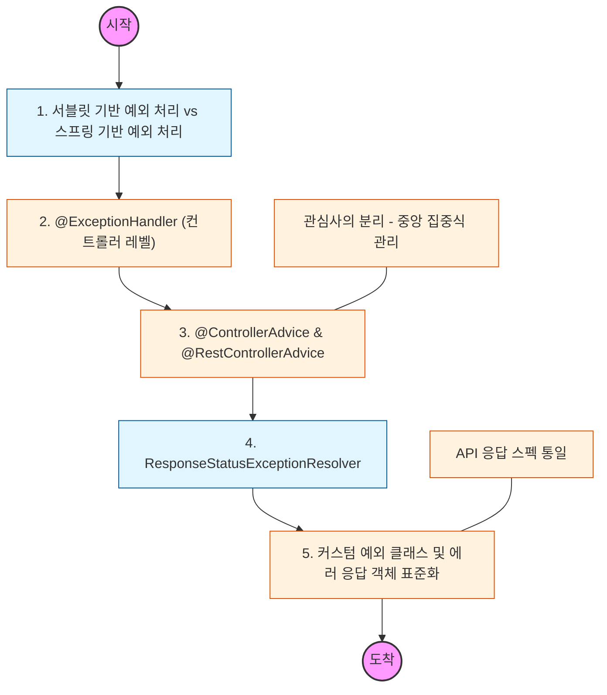

# 🧭 Spring Exception Handling: 전략적 예외 처리

> **해당 학습의 목표:** 컨트롤러마다 중복되는 예외 처리 로직을 분리하고, 전역 예외 처리기(Global Exception Handler)를 통해 클라이언트에게 명확한 에러 메시지를 반환하는 구조를 설계해야 함.

---

## 🛣️ Learning Roadmap

---

## 🔍 상세 학습 가이드

### **1. @ExceptionHandler를 통한 개별 처리**

* **내용:** 특정 컨트롤러 내에서 발생하는 예외를 직접 잡아서 처리하는 방식을 학습해야 함.
* **핵심:** 컨트롤러의 비즈니스 로직과 예외 처리 로직이 섞여 코드가 비대해지는 단점을 파악하고, 이를 분리할 방법을 고민해야 함.

### **2. @RestControllerAdvice를 이용한 전역 처리**

* **내용:** 프로젝트 전체에서 발생하는 예외를 한곳에서 가로채어 처리하는 Global Exception Handler를 구현해야 함.
* **Why?** 모든 컨트롤러에 중복된 예외 처리 코드를 제거하고, 에러 발생 시 일관된 JSON 응답 형식을 유지하기 위해 반드시 도입해야 함.

### **3. ResponseStatusException과 상태 코드 매핑**

* **내용:** `@ResponseStatus` 어노테이션이나 `ResponseStatusException`을 통해 HTTP 상태 코드(400, 404, 500 등)를 적절히 반환하는 법을 익혀야 함.
* **핵심:** 예외의 성격에 맞는 정확한 HTTP 상태 코드를 선택하여 클라이언트가 에러의 원인을 쉽게 파악할 수 있도록 설계해야 함.

### **4. API 에러 응답 객체(Error Response Object) 표준화**

* **내용:** 에러 코드, 메시지, 발생 시간 등을 담은 공통 에러 응답 객체를 정의해야 함.
* **Why?** 클라이언트(프론트엔드)가 에러 응답을 받았을 때, 항상 동일한 구조의 JSON을 파싱할 수 있도록 규격을 약속해야 함.

### **5. 스프링 부트의 기본 예외 처리 메커니즘**

* **내용:** 스프링 부트가 제공하는 `BasicErrorController`의 동작 방식과 `/error` 경로로 리다이렉트되는 과정을 이해해야 함.
* **상황:** API 환경에서는 HTML 에러 페이지가 아닌 JSON 응답이 우선되도록 설정이 제대로 되어 있는지 확인해야 함.

---

## 🔗 관련 참고 자료

* [Spring 공식 문서 - Exception Handling](https://docs.spring.io/spring-framework/reference/web/webmvc/mvc-controller/ann-exceptionhandler.html)
* [Error Handling for REST with Spring](https://www.baeldung.com/exception-handling-for-rest-with-spring)