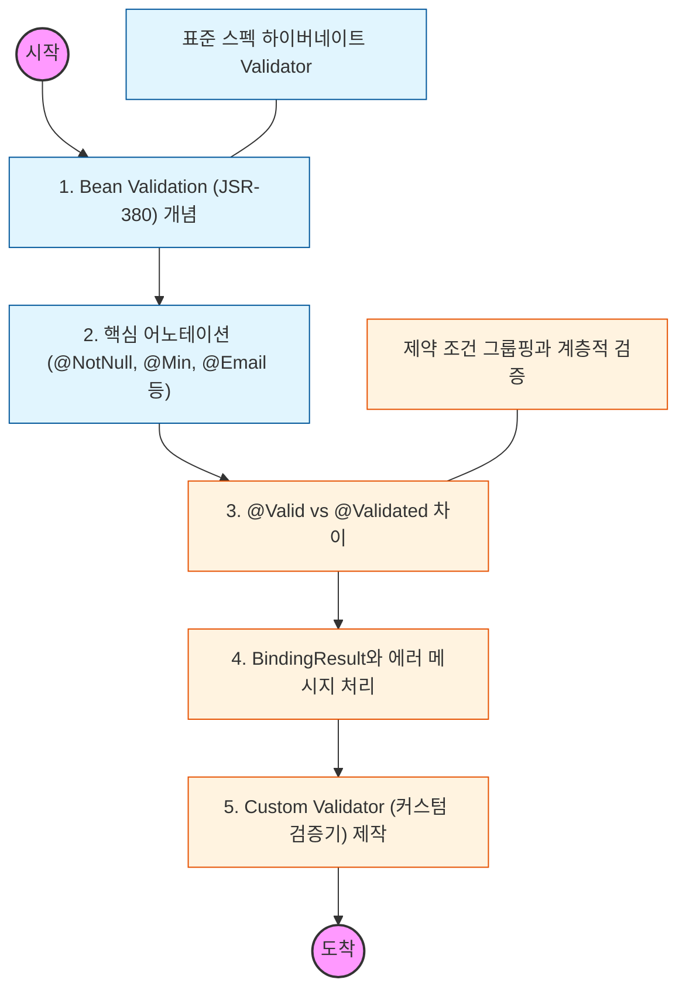

# 🧭 Spring Validation: 데이터 무결성 보장

> **해당 학습의 목표:** 어노테이션 기반의 표준 검증 방식(Bean Validation)을 익히고, 복잡한 검증 로직을 컨트롤러 밖에서 처리하는 법을 학습해야 함.

---

## 🛣️ Learning Roadmap

---

## 🔍 상세 학습 가이드

### **1. Bean Validation과 Hibernate Validator**

* **내용:** 자바 표준 검증 인터페이스인 Bean Validation과 그 구현체인 Hibernate Validator의 관계를 이해해야 함.
* **Why?** 특정 프레임워크에 종속되지 않는 표준 어노테이션을 사용하여 도메인 모델의 제약 조건을 선언적으로 정의해야 함.

### **2. @Valid와 @Validated의 활용**

* **내용:** 자바 표준인 `@Valid`와 스프링 전용 기능인 `@Validated`의 차이점을 파악해야 함.
* **핵심:** 컨트롤러 파라미터 검증에는 `@Valid`를, 서비스 계층의 검증이나 제약 조건 그룹핑(Groups)이 필요한 경우에는 `@Validated`를 사용해야 함.

### **3. BindingResult를 이용한 에러 제어**

* **내용:** 검증 오류 발생 시 즉시 예외를 던지지 않고, `BindingResult` 객체에 담아 비즈니스 로직에서 처리하는 법을 익혀야 함.
* **Why?** 검증 오류 발생 시 클라이언트에게 어떤 필드에서 어떤 오류(NotBlank, Range 등)가 발생했는지 상세히 전달하기 위해 활용해야 함.

### **4. 에러 메시지 국제화와 메시지 소스**

* **내용:** `errors.properties` 파일을 생성하여 하드코딩된 메시지 대신 관리되는 메시지를 출력하는 법을 학습해야 함.
* **핵심:** 오류 코드의 우선순위(상세한 것에서 범용적인 것으로)를 이해하고 적절한 에러 메시지를 노출해야 함.

### **5. 커스텀 어노테이션 및 Validator 제작**

* **내용:** 기본 어노테이션으로 해결할 수 없는 복잡한 로직(예: 중복 아이디 체크 등)을 위해 직접 검증 어노테이션을 만들어야 함.
* **상황:** `ConstraintValidator` 인터페이스를 구현하여 재사용 가능한 커스텀 검증기를 설계하고 적용해야 함.

---

## 🔗 관련 참고 자료

* [Spring 공식 문서 - Validation, Data Binding, and Type Conversion](https://docs.spring.io/spring-framework/reference/core/validation.html)
* [Hibernate Validator - Official Documentation](https://hibernate.org/validator/documentation/)