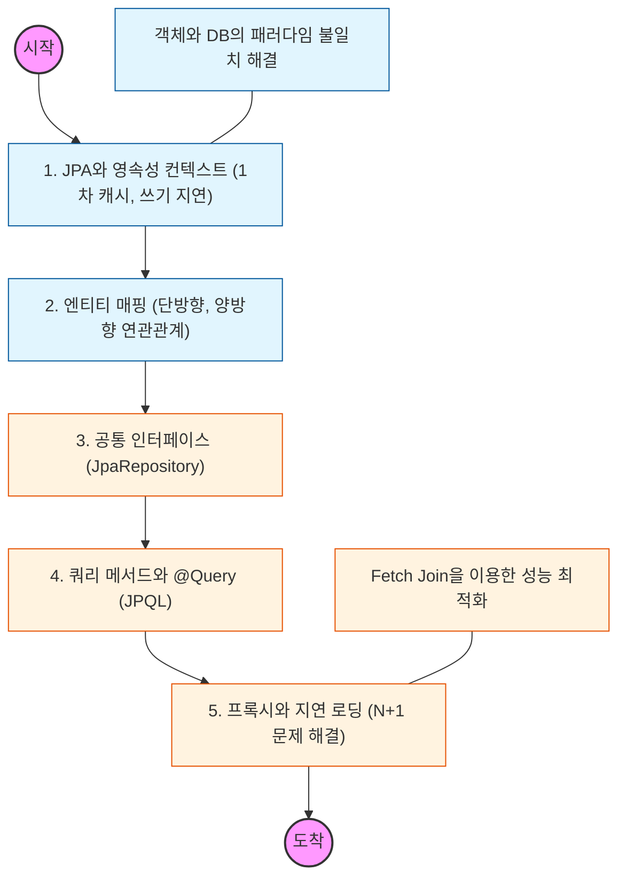

# 🧭 Spring Data JPA: 데이터 접근 계층의 혁신

> **해당 학습의 목표:** JPA의 핵심인 영속성 컨텍스트를 이해하고, 반복적인 CRUD 코드를 자동화하는 리포지토리 추상화 기술을 마스터해야 함.

---

## 🛣️ Learning Roadmap

---

## 🔍 상세 학습 가이드

### **1. 영속성 컨텍스트와 엔티티 생명주기**

* **내용:** 엔티티를 영구 저장하는 환경인 영속성 컨텍스트의 4가지 상태(비영속, 영속, 준영속, 삭제)를 이해해야 함.
* **핵심:** 1차 캐시, 동일성 보장, 쓰기 지연, 변경 감지(Dirty Checking)가 어떻게 성능과 정합성을 높이는지 파악해야 함.

### **2. 연관관계 매핑 (ORM의 정수)**

* **내용:** `@ManyToOne`, `@OneToMany` 등 객체의 참조와 테이블의 외래 키를 매핑하는 방법을 익혀야 함.
* **Why?** 객체 그래프 탐색이 가능하도록 단방향/양방향 관계를 설정하되, 무분별한 양방향 매핑은 지양하고 설계의 중심을 외래 키가 있는 곳(연관관계의 주인)에 두어야 함.

### **3. JpaRepository와 쿼리 메서드**

* **내용:** 인터페이스 선언만으로 CRUD가 완성되는 `JpaRepository` 활용법을 학습해야 함.
* **핵심:** 메서드 이름만으로 쿼리를 생성하는 규칙을 숙지하고, 복잡한 쿼리는 `@Query`를 통해 JPQL을 직접 작성하거나 Querydsl 도입을 고려해야 함.

### **4. 프록시와 지연 로딩 (Lazy Loading)**

* **내용:** 연관된 객체를 실제 사용하는 시점에 조회하는 지연 로딩과 가짜 객체(Proxy)의 원리를 파악해야 함.
* **상황:** 실무에서는 성능을 위해 기본적으로 모든 연관관계를 지연 로딩으로 설정하고, 필요한 경우에만 즉시 로딩으로 최적화해야 함.

### **5. N+1 문제와 성능 최적화**

* **내용:** 1번의 쿼리로 N개의 데이터를 가져왔을 때, 연관 데이터 조회를 위해 추가 쿼리가 N번 발생하는 현상을 분석해야 함.
* **해결:** `Fetch Join`이나 `@EntityGraph`를 사용하여 한 번의 조인 쿼리로 데이터를 가져와 네트워크 비용을 줄여야 함.

---

## 🔗 관련 참고 자료

* [Spring Data JPA Reference Documentation](https://docs.spring.io/spring-data/jpa/docs/current/reference/html/)
* [자바 ORM 표준 JPA 프로그래밍 (김영한 저)] - JPA 학습의 필수 교과서