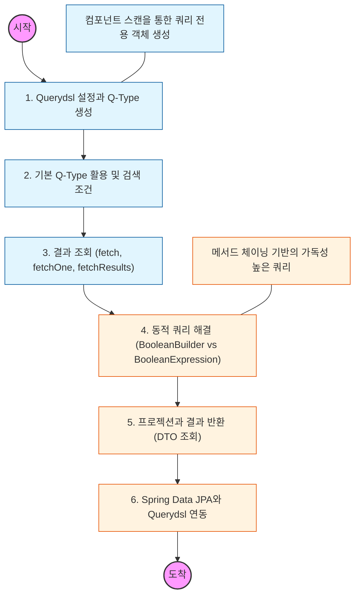

# 🧭 Querydsl: 타입 안정적인 동적 쿼리

> **해당 학습의 목표:** 자바 코드로 쿼리를 작성하여 문법 오류를 컴파일 단계에서 방지하고, 조건에 따라 실행되는 동적 쿼리 작성 능력을 갖추어야 함.

---

## 🛣️ Learning Roadmap

---

## 🔍 상세 학습 가이드

### **1. Q-Type 생성 및 환경 설정**

* **내용:** APT(Annotation Processing Tool)가 엔티티 클래스를 분석하여 쿼리용 객체인 **Q-Type** 클래스를 생성하는 원리를 이해해야 함.
* **핵심:** 빌드 도구(Gradle/Maven) 설정을 통해 컴파일 시점에 Q-Type 파일들이 올바른 경로에 생성되도록 관리해야 함.

### **2. 기본 문법과 메서드 체이닝**

* **내용:** `select`, `from`, `where`, `orderBy`, `groupBy` 등 SQL과 유사한 메서드를 사용하여 쿼리를 구성하는 법을 익혀야 함.
* **Why?** 문자열이 아닌 자바 코드로 작성하므로 오타로 인한 런타임 에러를 방지하고 IDE의 자동 완성 기능을 적극 활용해야 함.

### **3. 동적 쿼리 처리 전략**

* **내용:** `BooleanBuilder`를 사용하는 방식과 `BooleanExpression`(Where 다중 파라미터)을 사용하는 방식의 차이를 파악해야 함.
* **핵심:** 실무에서는 쿼리의 재사용성과 가독성을 높이기 위해 **BooleanExpression**을 반환하는 메서드 분리 방식을 우선적으로 고려해야 함.

### **4. 프로젝션과 DTO 조회**

* **내용:** 엔티티 전체가 아닌 필요한 필드만 뽑아내는 프로젝션(Projection) 기법을 학습해야 함.
* **Why?** 성능 최적화를 위해 DB에서 필요한 데이터만 조회해야 하며, `@QueryProjection`을 사용하여 결과 데이터를 DTO로 안전하게 변환하는 법을 숙지해야 함.

### **5. Spring Data JPA 연동 및 사용자 정의 리포지토리**

* **내용:** `JpaRepository` 인터페이스와 Querydsl 구현체를 결합하는 사용자 정의 리포지토리 구조(Custom Repository)를 구축해야 함.
* **상황:** 복잡한 통계 쿼리나 동적 검색이 필요한 기능은 Querydsl 전용 리포지토리에 분리하여 관리함으로써 아키텍처의 유연성을 확보해야 함.

---

## 🔗 관련 참고 자료

* [Querydsl 공식 사이트 - Reference Guide](http://querydsl.com/static/querydsl/latest/reference/html/)
* [실전! Querydsl (인프런 - 김영한 강좌)] - 실무 활용을 위한 최고의 가이드