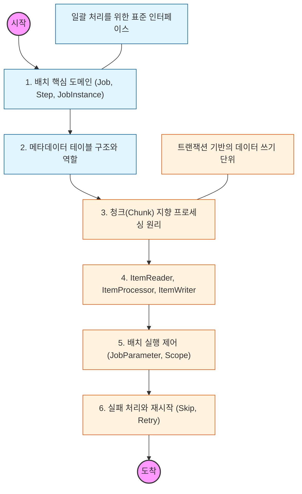

# 🧭 Spring Batch: 대규모 데이터 처리 아키텍처

> **해당 학습의 목표:** 수백만 건의 데이터를 성능 저하 없이 처리할 수 있는 청크 기반 프로세싱을 이해하고, 배치 메타데이터 테이블을 통한 실행 제어 능력을 갖추어야 함.

---

## 🛣️ Learning Roadmap

---

## 🔍 상세 학습 가이드

### **1. 배치 핵심 도메인 모델**

* **내용:** Job(전체 배치), Step(배치의 단계), JobInstance(실행 기록), JobExecution(실행 상태) 간의 계층 구조를 파악해야 함.
* **Why?** 배치가 언제 실행되었는지, 성공했는지, 실패했다면 어디서부터 다시 시작해야 하는지를 관리하는 배치 인프라의 기본 단위를 이해해야 함.

### **2. 메타데이터 테이블 (Meta-Data Schema)**

* **내용:** Spring Batch가 내부적으로 사용하는 `BATCH_JOB_INSTANCE`, `BATCH_STEP_EXECUTION` 등 데이터베이스 테이블의 역할을 학습해야 함.
* **핵심:** 동일한 JobParameter로 실행했을 때 왜 중복 실행 오류가 발생하는지, 상태 값이 어떻게 DB에 기록되는지 파악해야 함.

### **3. 청크(Chunk) 지향 프로세싱**

* **내용:** 데이터를 하나씩 처리하는 것이 아니라, 설정한 청크 단위(예: 1,000건)로 트랜잭션을 커밋하는 메커니즘을 이해해야 함.
* **Why?** 수만 건의 데이터를 한 번에 커밋하면 메모리 부족이나 트랜잭션 타임아웃이 발생하므로, 적절한 청크 단위로 끊어서 처리하여 시스템 안정성을 확보해야 함.

### **4. ItemReader, Processor, Writer**

* **내용:** 데이터를 읽어오는 Reader, 가공하는 Processor, 저장하는 Writer의 역할을 명확히 구분해야 함.
* **핵심:** 특히 Paging 기반 Reader와 Cursor 기반 Reader의 차이점을 분석하고, 대용량 데이터 조회 시 메모리 효율을 극대화할 수 있는 방식을 선택해야 함.

### **5. 배치 실행 제어와 Scope**

* **내용:** `@JobScope`와 `@StepScope`를 사용하여 런타임에 JobParameter를 주입받는 늦은 바인딩(Late Binding) 기법을 익혀야 함.
* **상황:** 매일 변경되는 날짜 값을 파라미터로 받아 배치를 실행하고, 같은 파라미터로 재실행이 필요한 상황을 통제할 수 있어야 함.

### **6. 예외 처리 전략 (Skip & Retry)**

* **내용:** 데이터 유효성 오류 발생 시 해당 건만 건너뛰는 `Skip`과, 일시적인 네트워크 오류 시 다시 시도하는 `Retry` 설정을 학습해야 함.
* **Why?** 단 한 건의 데이터 오류 때문에 전체 배치가 중단되는 불상사를 막고, 비즈니스 요구사항에 맞는 복구 전략을 설계해야 함.

---

## 🔗 관련 참고 자료

* [Spring Batch Reference Documentation](https://docs.spring.io/spring-batch/docs/current/reference/html/)
* [기억보단 기록을 - Spring Batch 가이드 (우아한형제들 기술블로그)]