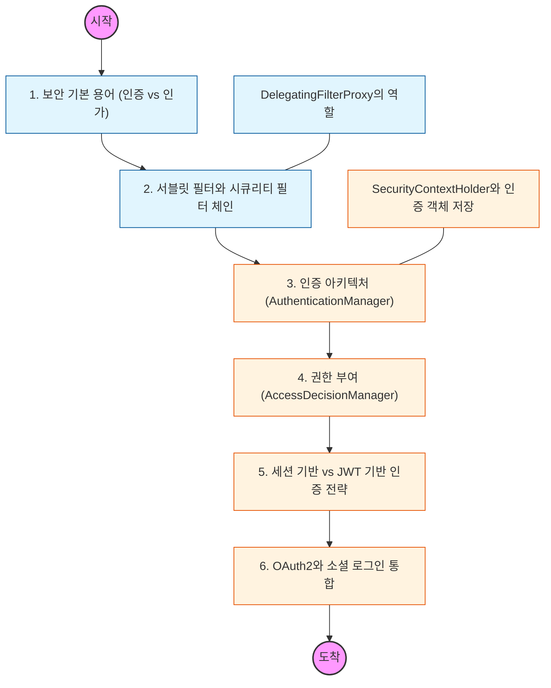

# 🧭 Spring Security: 인증과 인가의 핵심 아키텍처

> **해당 학습의 목표:** 스프링 시큐리티의 필터 기반 동작 원리를 파악하고, 세션 및 JWT 등 다양한 인증 방식을 프로젝트에 맞게 구현할 수 있어야 함.

---

## 🛣️ Learning Roadmap

---

## 🔍 상세 학습 가이드

### **1. 인증(Authentication)과 인가(Authorization)**

* **내용:** 사용자가 누구인지 확인하는 '인증'과, 인증된 사용자가 특정 자원에 접근할 권한이 있는지 확인하는 '인가'의 차이를 명확히 구분해야 함.
* **Why?** 두 개념이 분리되어야 계정 탈취 방지(인증)와 권한 오용 방지(인가)를 위한 설계를 각각 정교하게 할 수 있어야 함.

### **2. 시큐리티 필터 체인 (Security Filter Chain)**

* **내용:** 서블릿 컨테이너의 필터와 스프링 빈 사이를 연결하는 `DelegatingFilterProxy`와 실제 보안 로직이 수행되는 수십 개의 필터 뭉치를 이해해야 함.
* **핵심:** 요청이 컨트롤러에 도달하기 전, 어느 필터에서 인증이 일어나고 로그인이 확인되는지 그 순서를 파악해야 함.

### **3. 인증 프로세스 핵심 컴포넌트**

* **내용:** `AuthenticationManager`, `AuthenticationProvider`, `UserDetailsService`의 협력 관계를 분석해야 함.
* **핵심:** 실제 DB에서 사용자 정보를 가져오는 로직은 `UserDetailsService`에 구현하고, 비밀번호 검증은 `PasswordEncoder`를 사용해야 함을 숙지해야 함.

### **4. SecurityContext와 ThreadLocal**

* **내용:** 인증이 완료된 사용자 정보(Principal)가 `SecurityContextHolder`에 저장되어 애플리케이션 전역에서 사용되는 원리를 이해해야 함.
* **주의:** 한 요청(Thread) 내에서 사용자 정보가 어떻게 공유되고, 요청이 끝날 때 어떻게 비워지는지 파악해야 함.

### **5. 현대적인 인증 방식: JWT (JSON Web Token)**

* **내용:** 상태를 유지하지 않는(Stateless) 서버 구축을 위해 세션 대신 JWT를 생성하고 검증하는 커스텀 필터를 작성하는 법을 익혀야 함.
* **상황:** Refresh Token을 도입하여 보안성을 높이고, 토큰 만료 시나리오를 어떻게 처리할지 설계해야 함.

### **6. 웹 보안 공격 방어 (CSRF, XSS)**

* **내용:** 사이트 간 요청 위조(CSRF) 방지 설정과 보안 헤더 설정 등 스프링 시큐리티가 기본적으로 제공하는 방어 기능을 학습해야 함.
* **Why?** API 서버의 경우 CSRF 설정을 꺼도 되는 이유와, 브라우저 기반 클라이언트와의 통신 시 주의점을 인지해야 함.

---

## 🔗 관련 참고 자료

* [Spring Security Reference Documentation](https://docs.spring.io/spring-security/reference/index.html)
* [OAuth 2.0 Simplified](https://www.oauth.com/) - 소셜 로그인 연동 시 필독 자료