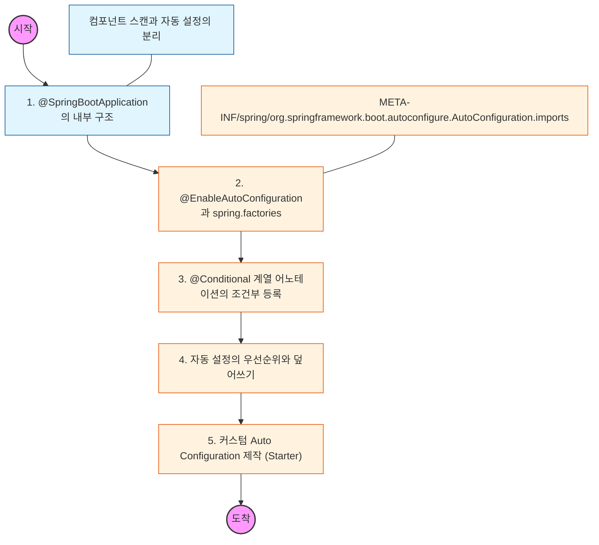

# 🧭 Spring Boot Auto Configuration: 자동 설정의 비밀

> **해당 학습의 목표:** 스프링 부트가 클래스패스에 있는 라이브러리를 감지하여 빈을 자동으로 등록하는 원리를 이해하고, 필요한 경우 이를 커스텀하거나 제외할 수 있어야 함.

---

## 🛣️ Learning Roadmap

---

## 🔍 상세 학습 가이드

### **1. @SpringBootApplication 파헤치기**

* **내용:** `@SpringBootConfiguration`, `@ComponentScan`, `@EnableAutoConfiguration` 세 가지 핵심 어노테이션의 역할을 분석해야 함.
* **Why?** 단순한 시작점이 아니라, 빈을 스캔하는 위치를 지정하고 자동 설정을 활성화하는 엔진임을 이해해야 함.

### **2. 자동 설정 로딩 메커니즘**

* **내용:** 스프링 부트가 실행될 때 특정 파일(구 버전 `spring.factories`, 신 버전 `AutoConfiguration.imports`)을 읽어 자동 설정 대상 클래스들을 불러오는 과정을 학습해야 함.
* **핵심:** 모든 설정 클래스가 무조건 등록되는 것이 아니라, 뒤에 나오는 '조건'에 부합할 때만 빈으로 등록된다는 사실을 인지해야 함.

### **3. @Conditional 어노테이션 (마법의 근원)**

* **내용:** `@ConditionalOnClass`(클래스 존재 여부), `@ConditionalOnMissingBean`(빈 중복 등록 방지), `@ConditionalOnProperty`(설정 값 기반) 등의 사용법을 익혀야 함.
* **Why?** 사용자가 직접 빈을 등록했을 때 스프링 부트의 자동 설정 빈이 밀려나는(Overriding) 원리가 바로 `@ConditionalOnMissingBean` 덕분임을 이해해야 함.

### **4. 자동 설정의 순서와 제외**

* **내용:** `@AutoConfigureAfter` 또는 `@AutoConfigureBefore`를 통해 설정 클래스 간의 실행 순서를 제어하는 법을 배워야 함.
* **상황:** 불필요한 자동 설정이 동작하여 충돌이 발생할 경우, `@SpringBootApplication(exclude = ...)`를 통해 특정 설정을 제외하는 법을 숙지해야 함.

### **5. 나만의 스타터(Starter) 만들기**

* **내용:** 공통 라이브러리나 회사 내 표준 설정을 여러 프로젝트에서 공유하기 위해 커스텀 Auto Configuration을 포함한 스타터 프로젝트를 구성하는 실습을 해야 함.
* **핵심:** 사용자 정의 프로퍼티(`@ConfigurationProperties`)를 연동하여 외부 설정 파일(`application.yml`)로 값을 제어할 수 있도록 설계해야 함.

---

## 🔗 관련 참고 자료

* [Spring Boot Reference Guide - Auto-configuration](https://www.google.com/search?q=https://docs.spring.io/spring-boot/docs/current/reference/html/using.html%23using.auto-configuration)
* [Creating Your Own Auto-configuration](https://www.google.com/search?q=https://docs.spring.io/spring-boot/docs/current/reference/html/features.html%23features.developing-auto-configuration)