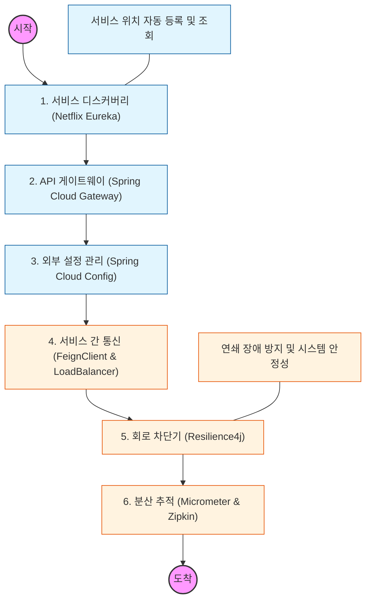

# 🧭 Spring Cloud: 마이크로서비스 생태계 구축

> **해당 학습의 목표:** 단일 서버(Monolithic)를 넘어 여러 서비스가 유기적으로 통신하는 분산 시스템의 핵심 컴포넌트와 운영 전략을 마스터해야 함.

---

## 🛣️ Learning Roadmap

---

## 🔍 상세 학습 가이드

### **1. 서비스 디스커버리 (Service Discovery)**

* **내용:** 수많은 서비스 인스턴스의 IP와 포트 번호를 동적으로 관리하는 Netflix Eureka의 동작 방식을 파악해야 함.
* **Why?** 클라우드 환경에서 유동적으로 변하는 서버 주소를 하드코딩하지 않고, 서비스 이름만으로 통신할 수 있는 기반을 마련해야 함.

### **2. API 게이트웨이 (API Gateway)**

* **내용:** 클라이언트의 요청을 적절한 마이크로서비스로 라우팅하고, 인증/인가 및 필터링을 수행하는 Spring Cloud Gateway를 학습해야 함.
* **핵심:** 모든 요청의 단일 진입점으로서 부하 분산(Load Balancing)과 공통 보안 로직을 처리하는 역할을 이해해야 함.

### **3. 중앙 집중형 설정 관리 (Config Server)**

* **내용:** 각 서비스의 설정 파일(yml)을 서버 수정 없이 실시간으로 반영할 수 있는 Spring Cloud Config와 Git 연동 방식을 익혀야 함.
* **상황:** 환경별(Dev, Prod) 설정 관리와 `@RefreshScope`를 통한 실시간 설정 변경 적용 메커니즘을 파악해야 함.

### **4. 선언적 HTTP 클라이언트 (OpenFeign)**

* **내용:** 인터페이스 선언만으로 마이크로서비스 간에 HTTP 통신을 수행할 수 있는 FeignClient 사용법을 익혀야 함.
* **핵심:** RestTemplate 대비 높은 가독성과 유지보수성을 확보하고, 클라이언트 사이드 로드밸런싱 원리를 이해해야 함.

### **5. 회로 차단기 (Circuit Breaker)**

* **내용:** 특정 서비스에 장애가 발생했을 때 장애가 전체 시스템으로 전파되는 것을 차단하는 Resilience4j의 핵심 기능을 학습해야 함.
* **Why?** 장애 발생 시 빠른 실패(Fail-fast)와 폴백(Fallback) 로직을 통해 시스템의 가용성을 유지하는 전략을 세워야 함.

### **6. 분산 추적 (Distributed Tracing)**

* **내용:** 여러 서비스를 거쳐가는 하나의 요청 흐름을 시각화하고 추적할 수 있는 Zipkin과 Micrometer Tracing을 도입해야 함.
* **핵심:** 로그만으로는 파악하기 힘든 마이크로서비스 간의 병목 지점과 에러 발생 위치를 한눈에 파악할 수 있어야 함.

---

## 🔗 관련 참고 자료

* [Spring Cloud Official Documentation](https://spring.io/projects/spring-cloud)
* [Microservices with Spring Boot and Spring Cloud (Udemy/Inflearn 강의군)]