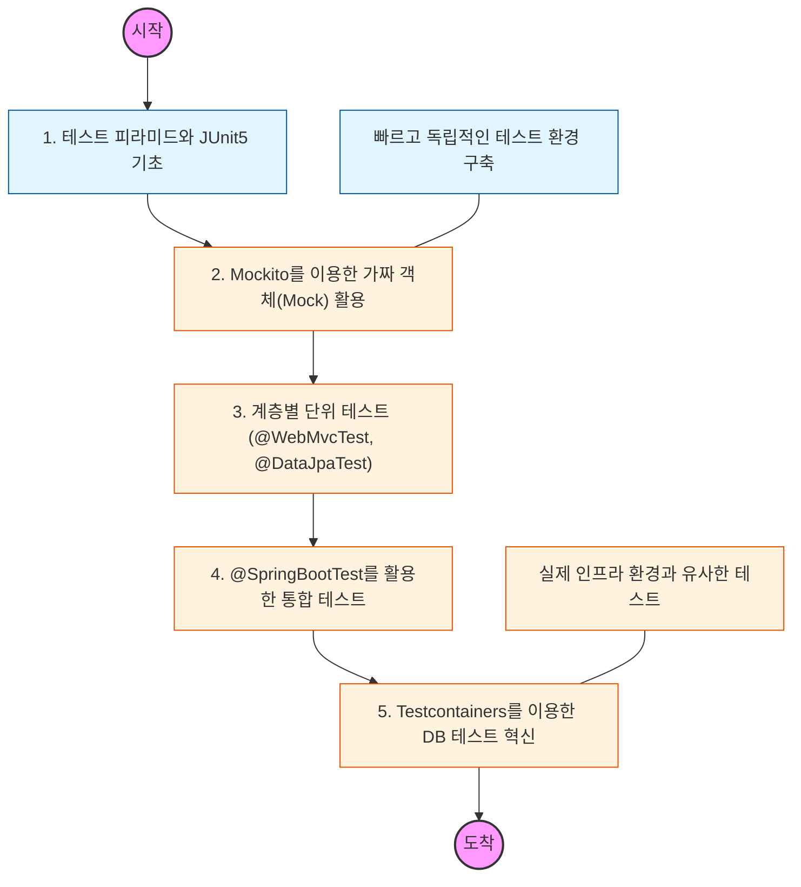

# 🧭 Spring 테스트 전략: 견고한 애플리케이션 구축

> **해당 학습의 목표:** 테스트 피라미드 이론을 바탕으로 단위 테스트와 통합 테스트의 차이를 이해하고, 상황에 맞는 적절한 테스트 도구(@SpringBootTest, Mockito 등)를 선택할 수 있어야 함.

---

## 🛣️ Learning Roadmap

---

## 🔍 상세 학습 가이드

### **1. 테스트 피라미드와 JUnit5**

* **내용:** 테스트의 대부분을 차지해야 하는 단위 테스트, 그리고 통합 테스트, E2E 테스트의 비율을 이해해야 함.
* **Why?** 실행 속도가 빠르고 비용이 저렴한 단위 테스트를 최대한 많이 작성하여 개발 사이클을 앞당겨야 함.

### **2. Mockito와 의존성 분리**

* **내용:** 테스트 대상이 의존하는 다른 객체를 가짜(Mock)로 대체하여 오직 해당 로직만 독립적으로 검증하는 법을 학습해야 함.
* **핵심:** `given-when-then` 패턴을 사용하여 테스트 코드의 가독성을 높이고, 특정 메서드의 호출 여부나 반환 값을 제어해야 함.

### **3. 슬라이스 테스트 (Slice Test)**

* **내용:** 전체 컨텍스트를 띄우지 않고 필요한 계층만 테스트하는 `@WebMvcTest`(컨트롤러), `@DataJpaTest`(리포지토리) 등을 익혀야 함.
* **Why?** 테스트 실행 시간을 획기적으로 단축하면서도 각 계층의 설정(필터, 매핑, 쿼리 등)이 올바른지 검증해야 함.

### **4. 통합 테스트와 @SpringBootTest**

* **내용:** 모든 빈을 컨테이너에 올리고 실제 환경과 가장 유사하게 동작을 검증하는 통합 테스트 작성법을 배워야 함.
* **주의:** 통합 테스트는 실행 비용이 높으므로 반드시 필요한 비즈니스 흐름(Happy Path) 위주로 구성해야 함.

### **5. Testcontainers를 활용한 인프라 테스트**

* **내용:** H2 같은 인메모리 DB 대신, Docker를 통해 실제 사용하는 DB(MySQL, PostgreSQL)나 Redis와 동일한 환경에서 테스트하는 법을 익혀야 함.
* **핵심:** "로컬에서는 성공했는데 운영 환경 DB에서는 실패하는" 문제를 원천 차단하기 위해 실무에서 적극적으로 도입해야 함.

### **6. RestAssured vs MockMvc**

* **내용:** API 테스트를 위해 서버를 띄우지 않고 테스트하는 `MockMvc`와 실제 HTTP 요청을 보내는 `RestAssured`의 장단점을 구분해야 함.
* **상황:** 내부 로직 검증은 `MockMvc`로, 외부 API 규격과 전체 흐름 검증은 `RestAssured`로 수행하는 전략을 세워야 함.

---

## 🔗 관련 참고 자료

* [Spring Boot Testing Documentation](https://docs.spring.io/spring-boot/reference/testing/index.html#testing)
* [JUnit 5 User Guide](https://junit.org/junit5/docs/current/user-guide/)